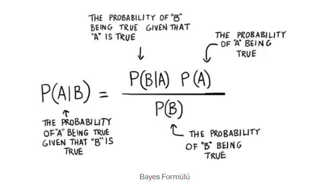
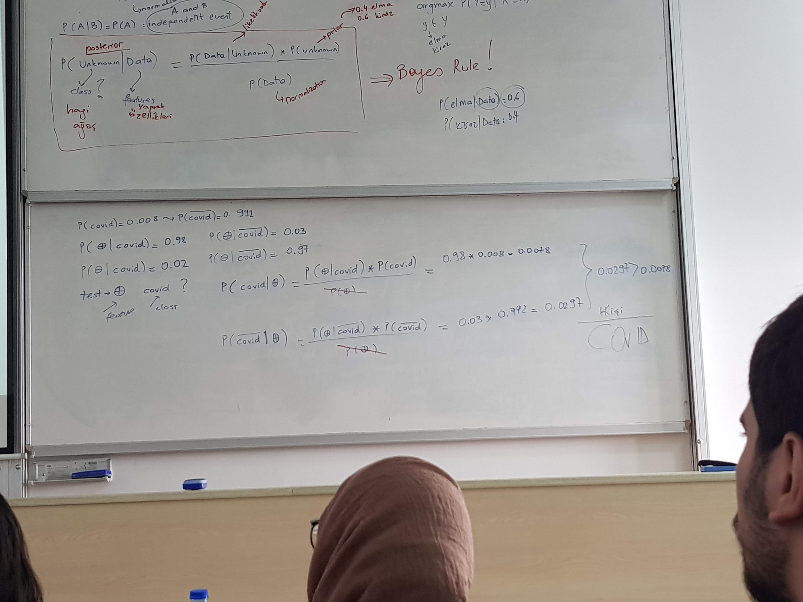
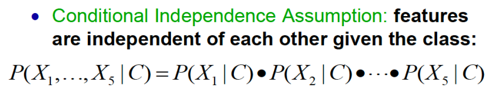

# Bayes And Naive Bayes

## Content
- [Bayes And Naive Bayes](#bayes-and-naive-bayes)
  - [Content](#content)
  - [Bayes](#bayes)
  - [Naive Bayes](#naive-bayes)
  - [References](#references)

## Bayes

1812 yılında Thomas Bayes tarafından bulunan koşullu olasılık hesaplama formülüdür.

Tanım : Bayes teoremi, olasılık kuramı içinde incelenen önemli bir konudur. Bu teorem bir rassal değişken için olasılık dağılımı içinde koşullu olasılıklar ile marjinal olasılıklar arasındaki ilişkiyi gösterir.

> P ( A | B ) = B olayı gerçekleştiğinde A olayının gerçekleşme olasılığı
 
> P ( A ) = A olayının gerçekleşme olasılığı
 
> P ( B | A ) = A olayı gerçekleştiğinde B olayının gerçekleşme olasılığı
 
> P ( B ) = B olayının gerçekleşme olasılığı

## Naive Bayes

Naive Bayes sınıflandırıcısının temeli Bayes teoremine dayanır. lazy ( tembel ) bir öğrenme algoritmasıdır aynı zamanda dengesiz veri kümelerinde de çalışabilir. Algoritmanın çalışma şekli bir eleman için her durumun olasılığını hesaplar ve olasılık değeri en yüksek olana göre sınıflandırır. Az bir eğitim verisiyle çok başarılı işler çıkartabilir. Test kümesindeki bir değerin eğitim kümesinde gözlemlenemeyen bir değeri varsa olasılık değeri olarak 0 verir yani tahmin yapamaz. Bu durum genellikle Zero Frequency ( Sıfır Frekans ) adıyla bilinir. Bu durumu çözmek için düzeltme teknikleri kullanılabilir. En basit düzeltme tekniklerinden biri Laplace tahmini olarak bilinir.

> Naive adını özelliklerin(features) bir birinden bağımsız olarak kabul etmesinden geliyor.

## References

* https://medium.com/@ekrem.hatipoglu/machine-learning-classification-naive-bayes-part-11-4a10cd3452b4
