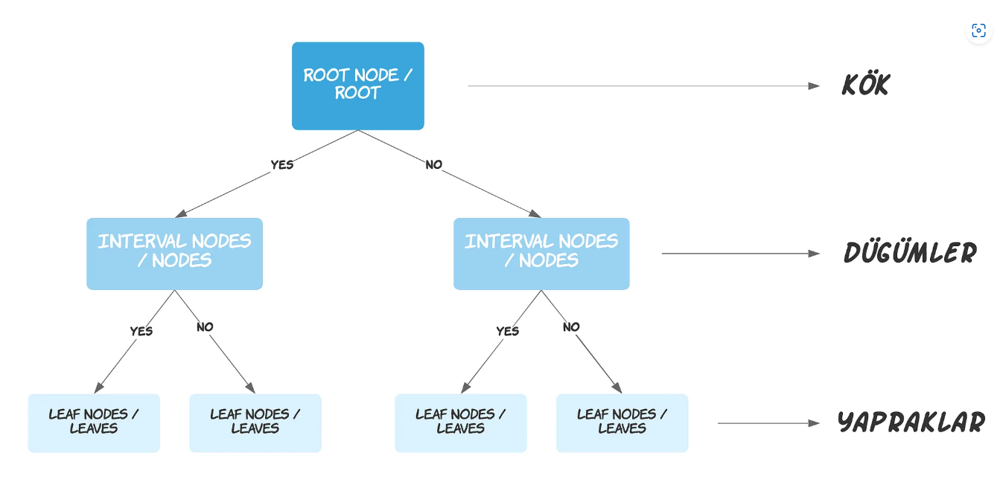
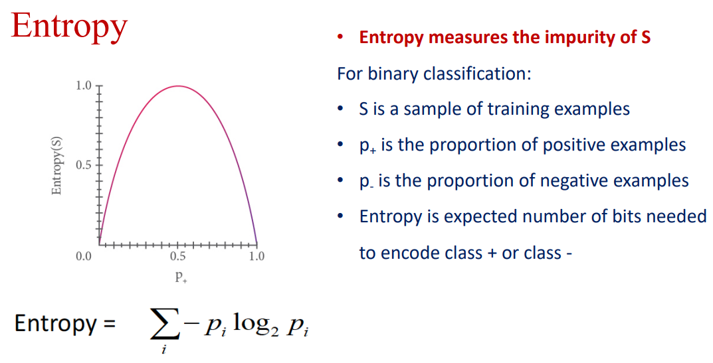
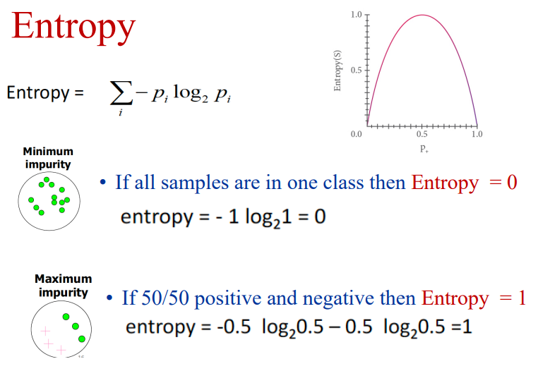
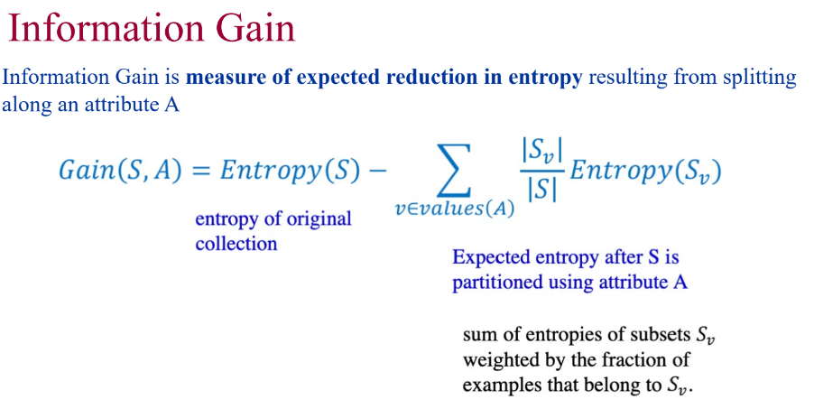

# Decision Tree

## Contents
- [Decision Tree](#decision-tree)
  - [Contents](#contents)
  - [Introduction](#introduction)
  - [References](#references)

## Introduction

Karar ağaçları, Sınıflandırma ve Regresyon problemlerinde kullanılan, ağaç tabanlı algoritmadan biridir. Karmaşık veri setlerinde kullanılabilir.

Karar ağaçlarının ilk hücrelerine kök (root veya root node) denir. Her bir gözlem kökteki koşula göre “Evet” veya “Hayır” olarak sınıflandırılır.

Kök hücrelerinin altında düğümler (interval nodes veya nodes) bulunur. Her bir gözlem düğümler yardımıyla sınıflandırılır. Düğüm sayısı arttıkça modelin karmaşıklığı da artar.

Karar ağacının en altında yapraklar (leaf nodes veya leaves) bulunur. Yapraklar, bize sonucu verir.

---

Temel yapı tabi ki bir ağaç yapısı oluşturmak. Ama ağaç yapısını nasıl oluşturacağımız sorusu ilk cevaplanması gereken soru. Bu nedenle özellikler üzerinden bilgi ederek hangi özellik bize en çok bilgiyi veriyor buna bakıyoruz ve ağaç yapımızı bunun üzerine kuruyoruz. İlk bulmamız gereken değer ENTROPY değeri.

Entropy temel olarak bir sistemdeki rastgelelik ve düzensizlik olarak tanımlanır.

> Eşit dağılmış bir verinin entropi değeri 1 yani en yüksek değer olarak çıkacaktır.

Entropi hesabından sonra mesele bilgi elde etmeye yani information gain elde etmeye geldi.

Yapılan bu işlemler sayesinde özellikler en çok bilgi sağlayandan en az bilgi sağlaya doğru olacak şekilde kökten yapraklara doğru yerleştirilmiş olacaktır. Bu sayede oluşturulan ağaç yapısı en efektif şekilde oluşturulmuş olacaktır.

Decision Tree de overfitting üzerine de durmak gerek. Bunun meydana gelmesinin en büyük nedenlerinden biri hatta ilki noise diyebiliriz. Bunu da şöyle gözlemlememiz mümkün. Train başarısına baktığımızda yüksek başarı elde ederken, test verisi üzerinde oldukça düşük başarı sergiliyorsa ağaç modelimiz, overfitting olmuş diyebiliriz.

Eğitim datasının çok küçük olması ve gürültülü data overfittinge sebep olabilir.

Bu durumu önlemek için 3 yöntemi kullanılabilir.

* **REDUCED ERROR PRUNING** ile verimizi 3 parçaya bölüyoruz. Train, Validation ve Test olmak üzere işlemlerimizi bu 3 veri seti üzerinden yürütüyoruz. Bu yöntemde Validation seti ile modelimizde iyileştirme yapıyoruz. Validation setinde verdiğimiz kararlara göre ağaç yapısında aşağıdan yukarıya doğru dallarda azaltmalara gidiyoruz.
* **EARLY STOPPING** yöntemi ile validation başarımızı aklımızda tutuyoruz ve başarı düşmeye başladığında duruyoruz.
* **RULE POST-PRUNING** yöntemi tüm ağaç yapısını inceleyerek gereksiz olduğu tespit edilen dalların çıkarılmasını sağlayan bir yöntemdir.

## References

* https://medium.com/deep-learning-turkiye/karar-a%C4%9Fa%C3%A7lar%C4%B1-makine-%C3%B6%C4%9Frenmesi-serisi-3-a03f3ff00ba5