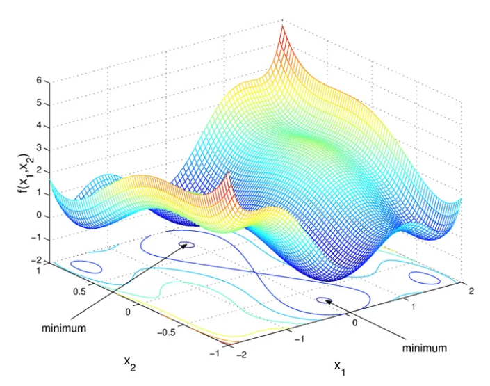
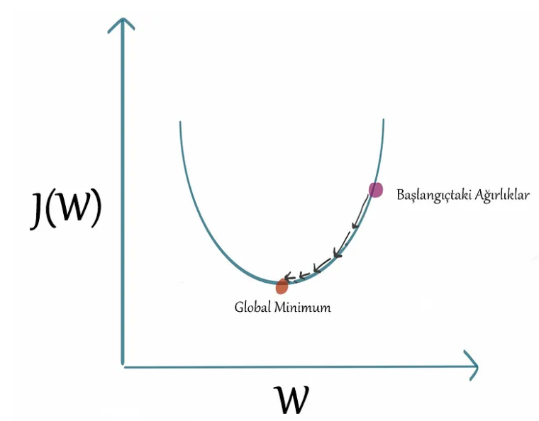
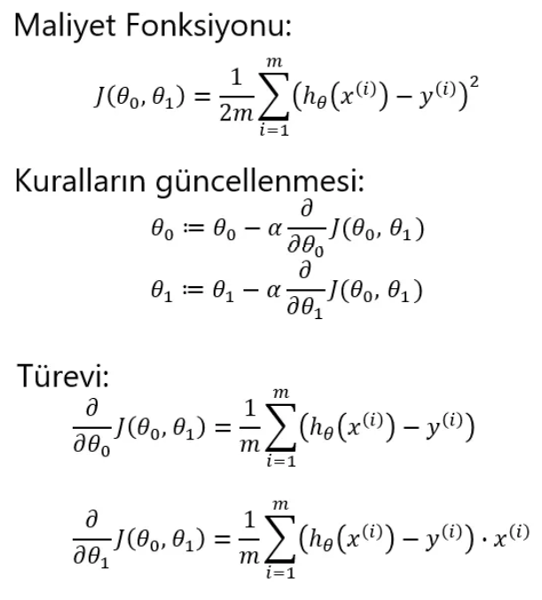
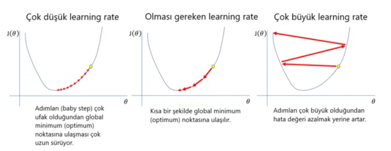
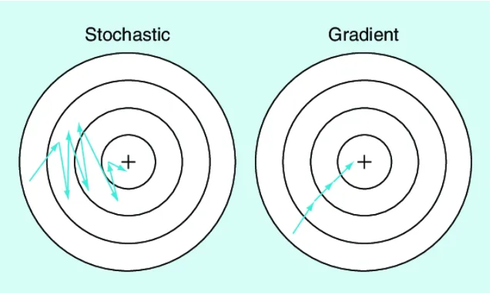
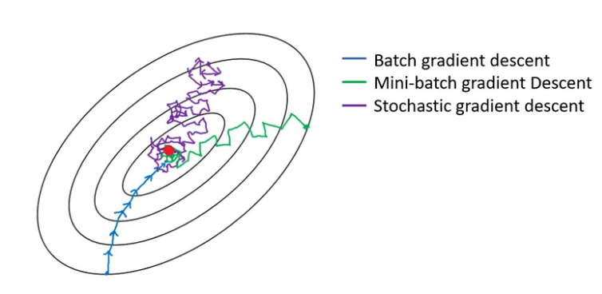

# Gradient Descent (Gradyan Azalma)

## İçerik
- [Gradient Descent (Gradyan Azalma)](#gradient-descent-gradyan-azalma)
  - [İçerik](#i̇çerik)
  - [Giriş](#giriş)
  - [İşlem adımları](#i̇şlem-adımları)
  - [Stochastic Gradient Descent](#stochastic-gradient-descent)
  - [Mini-Batch Gradient Descent](#mini-batch-gradient-descent)
  - [Referanslar](#referanslar)

## Giriş

Her öğrenme algoritmasının temelde 3 bölüme sahip olduğunu söylemek mümkündür.

1. Kayıp fonksiyonu
2. Kayıp fonksiyonuna dayanan bir optimizasyon ölçütü (örn. maliyet fonksiyonu)
3. Optimizasyon ölçütüne çözüm bulmak için eğitim verilerini kullanan optimizasyon rutini

Makine öğrenmesi ile ilgili modern literatürü okuduğumuzda, genel olarak gradyan iniş veya stokastik gradyan iniş ile karşılaşırız. Bunlar, optimizasyon ölçütünün farklılaştırılabildiği durumlarda en sık kullanılan iki optimizasyon algoritmasıdır. Gradyan iniş (Gradient Descent), bir fonksiyonun minimumunu bulmak için tekrarlanan bir optimizasyon algoritmasıdır. Bu algoritma kullanılarak bir fonksiyonun yerel minimum değerini bulmak için, rastgele bir noktada başlar ve geçerli noktadaki fonksiyonun dradyanının (veya yaklaşık gradyanın) negatifiyle orantılı adımlar atar.

Gradyan iniş, doğrusal ve lojistik regresyon, SVM ve sinir ağları için en uygun parametreleri bulmak için kullanılabilir. Lojistik regresyon veya SVM gibi birçok model için optimizasyon ölçütü dışbükeydir. Dışbükey fonksiyonların sadece bir minimum değeri vardır ve bu geneldir (küreseldir). Sinir ağları için optimizasyon ölçütleri dışbükey değildir; ancak uygulamalarda yerel minimum değerini bulmak bile yeterli olacaktır.

## İşlem adımları

1. Her parametre için Kayıp Fonksiyonun (loss function) türevini al.
   

2. Parametreler için rastgele değerler topla ve toplanan değerleri parametrelere gönder.
3. Adım büyüklüğü (step size) hesapla.

4. Yeni parametreyi hesapla.

5. Minimum seviyeye ulaşana kadar 2. adıma dön.

Gradient Descent temelinde türev olan bir optimizasyon işlemidir aslında. Bu işlemde temelde iki soru karşımıza çıkar aslında. Birincisi işlem adımı olarak tanımlayabileceğimiz *learning rate*, ikincisi ise başlangıç noktası olarak tanımlayabileceğimiz *start point*'dir.

## Stochastic Gradient Descent

Her adımda rastgele alınan 1 veri üzerinde işlem yapar. Noktalar sürekli değişerek optimum noktaya ulaşmayı amaçlar. Batch Gradient Descent’e göre daha hızlıdır. Stochastic Gradient Descent ile iyi bir sonuca ulaşılır ama optimum sonuca ulaşılamayabilir.

## Mini-Batch Gradient Descent

Veri seti içerisinden rastgele alınan örneklemler ile öğrenir. Diğer ikisinden daha hızlıdır. Stochastic Gradient Descent’e göre daha dengeli ilerler, onun kadar çok savrulmaz.

## Referanslar

* https://medium.com/deep-learning-turkiye/gradient-descent-nedir-3ec6afcb9900
