# Important Terms In Machine Learning

## İçerik
- [Important Terms In Machine Learning](#important-terms-in-machine-learning)
  - [İçerik](#i̇çerik)
  - [Machine Learning Model](#machine-learning-model)
  - [Overfitting](#overfitting)
  - [Underfitting](#underfitting)
  - [Varyans-Bias](#varyans-bias)
  - [Regularization (Düzenlileştirme)](#regularization-düzenlileştirme)
    - [Lasso Regularization](#lasso-regularization)
    - [Ridge Regurlarization](#ridge-regurlarization)
    - [Elasticnet](#elasticnet)
  - [Encoding](#encoding)
    - [Label Encoding](#label-encoding)
    - [One-Hot Encoding](#one-hot-encoding)
    - [Rare Encoding](#rare-encoding)
  - [Feature Scaling](#feature-scaling)
    - [Normalization (Normalizasyon)](#normalization-normalizasyon)
    - [Standartization (Standardizasyon)](#standartization-standardizasyon)
  - [Outlier](#outlier)
  - [Validation Methods](#validation-methods)
  - [Feature Selection (Özellik Seçimi)](#feature-selection-özellik-seçimi)
  - [Feature Extraction (Özellik Çıkarma)](#feature-extraction-özellik-çıkarma)
  - [Referanslar](#referanslar)

## Machine Learning Model

Makine öğrenmesi uygulamalarında temel amaç eldeki veriler üzerinden örüntüler elde etmek ve yeni veriler için bu örüntüler üzerinden doğru tahminler yapabilmektir. Bu tahminleri yapabilmek için makine öğrenmesi uygulamaları sonucunda bir model elde ederiz. Model girdilerin çıktılara eşlenmesi için kullanılan bir sistemdir. Örneğin amacımız ev fiyatlarını tahmin etmek olsun . Bunun için evin metrekare bilgisini girdi olarak kullanan bir model oluştururuz ve çıktı olarak da evin fiyatını elde ederiz.

Makine öğreniminde gelecek veriler hakkında tahmin yapabilmek için verilerimizi eğitim verileri (train) ve test verileri olmak üzere iki alt kümeye ayırıyoruz. Modelimizi eğitim verilerinden elde edilen örüntülere göre oluşturuyoruz. Bu işlem sonucunda iki şeyden biri olabilir; modelimiz aşırı öğrenebilir veya eksik öğrenebilir. Bu durumda modelimiz yeterli öngörüde bulunamayacak ve tahminlerimizde hata oranı yüksek 
olacaktır.

## Overfitting

Eğer modelimiz, eğitim için kullandığımız veri setimiz üzerinde gereğinden fazla çalışıp ezber yapmaya başlamışsa ya da eğitim setimiz tek düze ise overfitting olma riski büyük demektir. Eğitim setinde yüksek bir skor aldığımız bu modele, test verimizi gösterdiğimizde muhtemelen çok düşük bir skor elde edeceğiz. Çünkü model eğitim setindeki durumları ezberlemiştir ve test veri setinde bu durumları aramaktadır. En ufak bir değişiklikte ezberlenen durumlar bulunamayacağı için test veri setinde çok kötü tahmin skorları elde edebilirsiniz. **Overfitting problemi olan modellerde yüksek varyans, düşük bias durumu görülmektedir.**

Overfitting problemi aşağıdaki yöntemler uygulanarak çözülebilmektedir;

* Öz nitelik sayısını azaltmak: Birbirleriyle yüksek korelasyonlu olan kolonlar silinebilir ya da faktör analizi gibi yöntemlerle bu değişkenlerden tek bir değişken oluşturulabilir.
* Daha fazla veri eklemek : Eğer eğitim seti tek düze ise daha fazla veri ekleyerek veri çeşitliliği arttırılır.
* Regularization (Düzenleme) : Düzenleme, modelin karmaşıklığını azaltmak için bir kullanılan tekniktir. Bunu kayıp fonksiyonunu cezalandırarak yapar. Yani modelde ağırlığı yüksek olan değişkenlerin ağırlığını azaltarak bu değişkenlerin etki oranını azaltır. Bu yöntem, aşırı öğrenme probleminin çözülmesine yardımcı olur. Kayıp fonksiyonu, gerçek değer ile öngörülen değer arasındaki farkın karelerinin toplamıdır. Değişkenlerin ağırlığını azaltmak için regularization değerini arttırmak gerekmektedir. En popüler Regularization metotları **Lasso** ve **Ridge** teknikleridir.

## Underfitting

Aşırı öğrenmenin aksine, bir model yetersiz öğrenmeye sahipse, modelin eğitim verilerine uymadığı ve bu nedenle verilerdeki trendleri kaçırdığı anlamına gelir. Ayrıca modelin yeni veriler için genelleştirilemediği anlamına da gelir. Tahmin ettiğiniz gibi bu problem genellikle çok basit bir modelin sonucudur (yetersiz tahminleyici bağımsız değişken eksikliği).

Underfitting sorunu olan modellerde hem eğitim hem de test veri setinde hata oranı yüksektir. **Düşük varyans ve yüksek bias’a sahiptir.** Bu modeller eğitim verilerini çok yakından takip etmek yerine, eğitim verilerinden alınan dersleri yok sayar ve girdiler ile çıktılar arasındaki temel ilişkiyi öğrenemez.

## Varyans-Bias

Varyans, model eğitim veri setinde iyi performans gösterdiğinde, ancak bir test veri kümesi veya doğrulama veri kümesi gibi, eğitilmemiş bir veri kümesinde iyi performans göstermediğinde ortaya çıkar. Varyans, gerçek değerden tahmin edilen değerin ne kadar dağınık olduğunu söyler.

Bias, gerçek değerlerden tahmin edilen değerlerin ne kadar uzak olduğudur. Tahmin edilen değerler gerçek değerlerden uzaksa, bias yüksektir.

* Yüksek Bias Düşük Varyans: Modeller tutarlıdır, ancak ortalama hata oranı yüksektir. (Underfitting)
* Yüksek Bias Yüksek Varyans : Modeller hem hatalı hem de tutarsızdır .
* Düşük Bias Yüksek Varyans: Modeller bir dereceye kadar doğrudur ancak ortalamada tutarsızdır. Veri setinde ufak bir değişiklik yapıldığında büyük hata oranına neden olmaktadır. (Overfitting)
* Düşük Bias Düşük Varyans: Modeller ortalama olarak doğru ve tutarlıdır. Modellerimizde bu sonucu elde etmek için çabalamaktayız.

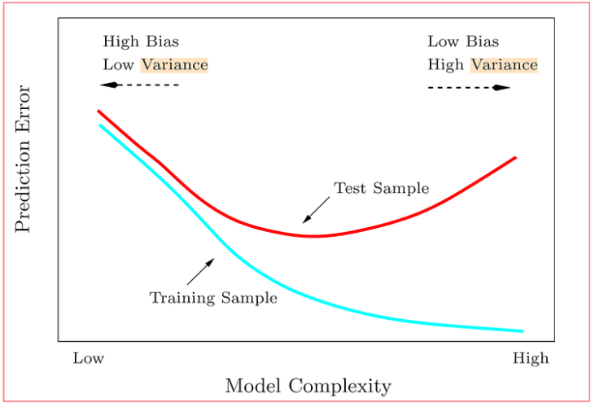

> Temel olarak bias dediğimiz şey train hatasını ifade ediyor. Train hatası ne kadar yüksek ise bias değerimiz o kadar yüksek demektir. Bu da underfitting yani modelin veri setini öğrenmediğini ifade ediyor.

> Varyansı anlamak içinse train hatası ve test hatasını bakmak yerinde olacaktır. Train hatası ve test hatası arasındaki fark bize varyansı verecektir. Varyans değeri yüksek ise model yeni bir veri gördüğü zaman başarı gösteremiyor demektir. Bu da bize modelimizin overfitting olduğunu gösterir.

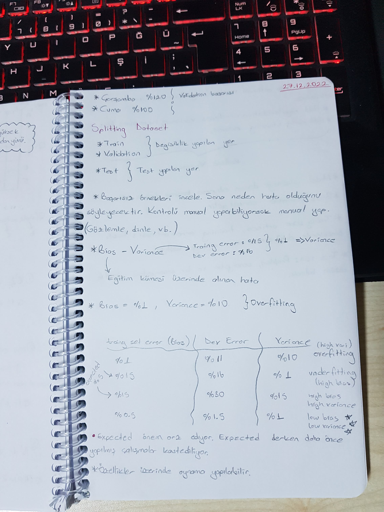

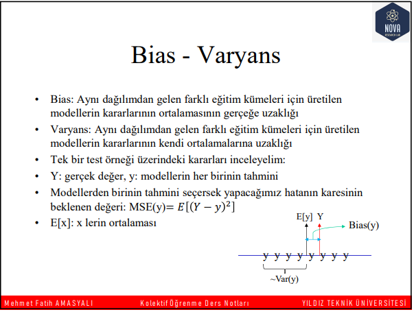

## Regularization (Düzenlileştirme)

Modellerin daha karmaşık hale gelmesi, veri seti boyutunun ve değişken sayısının artması model eğitiminde farklı optimizasyon yöntemlerinin uygulanmasını kaçınılmaz hale getirmiştir. Bu optimizasyon temel olarak iki şekilde sağlanabilir: (*i*) çoklu doğrusal bağlantıya yol açan ya da hedef değişkeni öngörmede gereksiz olan değişkenleri çıkarmak, (*ii*) öznitelik değişkenlerinin tahmin parametrelerini hedef değişkeni öngörmedeki öden derecelerine göre ağırlıklandırmaktır. Bu şekilde modelin karmaşıklığını modelin yanlılığına bağlı hata ile varyansına bağlı hata arasında denge kurarak düzelten optimizasyon tekniğine düzenlileştirme (regularization) denir.

### Lasso Regularization

Tüm değişkenler ile model kurar. İlgisiz olan değişkenleri direkt olarak sıfır yapar.

### Ridge Regurlarization

Tüm değişkenler ile model kurar. Değişkenleri ağırlıklandırır. İlgisiz olan değişkenleri sıfıra yaklaştırır.

### Elasticnet

Lasso Regularizaton veya Ridge Regularization arasında seçim yapmamızı sağlar.

## Encoding

Veri bilimi ve makine öğrenimi süreçlerinde, veri setlerinde bulunan kategorik değişken türlerinin (yazılar, cümleler gibi text/string formatında olan veriler) makinelerin anlayabileceği bir formatta yeniden yazmaya Encoding denir. Kategorik değişkenler, algoritmalar tarafından işlenebilir bir hale getirilmesi amacıyla, sayısal temsili değerlere dönüştürülür.
 

Encoding (karakter kodlaması) değişkenlerin temsil şekilleri ile ilgili değişiklikler yapmaktır. Yaygın kullanılan encoding yöntemlerine label encoding ve one-hot encoding örnek olarak verebiliriz. Gerekli görülmesi durumunda rare encoding gibi yöntemler de bu kapsamda kullanılabilir. Şimdi bu yöntemleri detaylı bir şekilde inceleyelim.

### Label Encoding

Bir kategorik değişkenin sınıfları labellardır. Label encoding bu sınıfları modellerde daha kullanışlı ve modellerin anlayabileceği hale getirecek şekilde kodlama yöntemlerinden biridir. Label encoding yapılacak olan bir kategorik değişkenin iki sınıfı olması durumunda yapılacak işleme özel olarak binary encoding (ikili karakter kodlaması) adı verilir. Örneğin string ifadeler ile temsil edilen kadın/erkek olma durumunu, 0 ve 1 değerlerini kullanarak ifade etmek bir label encoding yöntemidir.

Aynı şekilde farklı veri setlerinde de kategorik değişkenleri 0, 1, 2, 3 gibi sayısal olarak, kullanılacak yöntemlerin anlayabileceği bir dile çevirme şekillerinden birisidir. Bu kapsamda yukarıda betimlenen veri setinde gözlemlenen kadın erkek örneğindeki gibi elimizde iki sınıflı bir kategorik değişken olduğundan, bu iki sınıfta kategorik değişkenleri 0 ve 1 olacak şekilde dönüştürebiliriz.

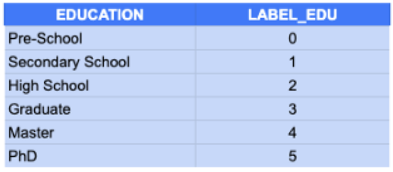

Bir başka örnek olarak elimizde, bir kategorik değişken olarak basketbol takımlarının yer aldığını düşünelim. Basketbol takım isimleri kategorik formda, bir string ifade olarak temsil edilir. Basketbol takımları değişkeni, yukarıdaki eğitim örneğinin aksine birbirleri arasında ordinal bir sıra belirtmediğinden kodlama işlemi, algoritmanın değişkeni sayısal büyüklük olarak  tanımaması adına 0’dan 5’e olacak şekilde yapılamaz. Kullanılacak olan algoritmalara ve yöntemlere göre farklılık gösteriyor olsa da, kullanacağımız bir takım modellemelerde, büyüklük-küçüklük algısı bozulabilir. Yani büyüklük-küçüklük durumu betimlenmemesi gerektiği halde bir takımın sınıfının diğer takımın sınıfından büyük ya da küçük olarak algılanmasına neden olunabilir. Bu gibi durumlarda kullanılması gereken kodlama türü one-hot kodlamadır (one-hot encoding). One-hot encoding, her bir sınıfı bir sütun olarak farklı bir değişkene dönüştürerek, nominal kategorik değişkenlere encoding uygulanması kapsamında çözüm getirir. 

Label encoding bazı durumlarda bir kategorik değişkenin önemli olabilecek sınıflarını değişken haline getirerek, ilgili sınıfın gözlemlenme önemini vurgulamak amacıyla da kullanılabilir.

### One-Hot Encoding

Cinsiyet (kadın - erkek) değişkeni gibi sınıflar arası fark olmayan başka bir deyişle nominal değişkenlerde, label encoding kullanılması durumunda verilen sayısal temsiller, bir büyüklük küçüklük ifade etmesinden kaynaklı olarak ordinal değişkenlerde yapılan encodinge benzer şekilde sıralama durumunun oluşmasına sebep olur. Encode edilen nominal kategorik değişkenin sınıfları arasında sınıfsal bir farklılık olmamasına karşın, label encoding sonucu bir sınıfsal fark varmışcasına betimlemeye sebep olabilir. Bu nedenle label encoding tekniğini nominal değişkenler özelinde kullanmak doğru bir yaklaşım olarak nitelendirilmeyebilir. Bu durum ağaç tabanlı yöntemlerde, değişkenler arası bir sıralama ve dallara göre bölme işlemi barındırmasından ötürü etkisini göstermese de doğrusal ve fonksiyonel yöntemlerde ciddi seviyede hissedilecektir. Dolayısıyla nominal değişkenlerin gözlemlendiği durumlarda doğru bir değer dönüşümü ve temsil şekli uygulamak adına label encoding tercih edilmez. Nominal değişkenleri bir ölçüm problemine sebep olmadan oluşturmak adına one-hot encoding tekniği uygulamak çok daha doğru bir yaklaşım olacaktır. One-hot encoding tekniğinde nominal değişkenin sınıfları değişkenlere dönüştürülür. Yani nominal değişken, her bir sınıftan ayrı bir sütun (değişken) oluşturulması yoluyla encode edilir.

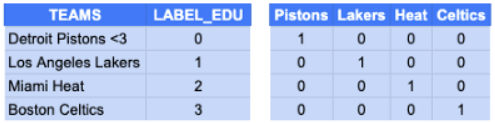

### Rare Encoding

Rare nadir, az gözlemlenen demektir. Bir veri setindeki kategorik değişkenlerin sınıflarının gözlenme sayılarını incelendiğinde bazı gözlem sınıflarının frekanslarının çok düşük olduğunu düşünelim. Bunun gibi bir senaryoda çok düşük frekanstaki gözlemler için one-hot encode ile bir değer ataması yapılması uygun olmayacaktır.  Çünkü çok düşük frekanstaki her bir gözlem için yeni bir sütun oluşturulacak, ilgili sınıfa ait olmayan diğer gruplar için 0 değeri verilecektir. Bu da çok sayıda 0’dan oluşan gereksiz sütunun oluşmasına neden olacaktır.

Model geliştirme süreçlerinde genellikle karmaşıklığın aksine, basitlik ve genellenebilirlik ile ilgileniyor oluruz. Buradaki genellenebilirlik, tüm veri setini kapsamaktan ziyade büyük çoğunluğu temsil etmek şeklinde nitelendirilebilir. Bir araba fiyat tahmin modelimiz olduğunu ve model için kullanılan veri setinde yüz binlerce satırlık bir veri setinde yalnızca birkaç satırda görülen değerler olduğunu düşünelim. Düşük frekansta gözlenen bu değerlerin modelde tekil olarak karşılık bulma ihtimali düşüktür. Öte yandan taşıdığı bilgi anlamında, bağımlı değişken için bir ayırt ediciliğe sahip olup olmama durumu da belli değildir. Bu kapsamnda gereksiz birçok fazla değişkenin mevcudiyeti hem iterasyon süreçlerini, hem opitmizasyon süreçlerini hem de ağaç yöntemlerindeki bölünme süreçlerini ciddi seviyede etkileyecektir. Gereksiz değişkenlerden uzaklaşmak amacıyla rare encoding kullanılması uygun olacaktır. 

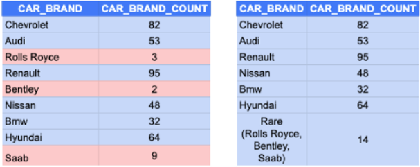

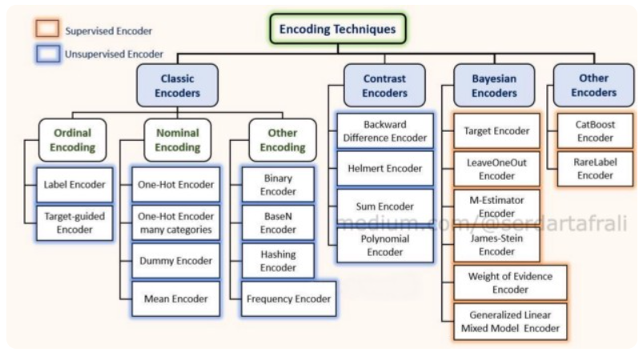

## Feature Scaling

Bazı makine öğrenmesi algoritmaları -özellikle mesafe/uzaklık (distance) üzerine kurgulanmış olanları- doğası gereği girdi değişkenlerinin birbirleri ile aynı aralıkta ve mümkünse küçük sayılardan oluşmasını tercih ediyorlar. Burada tercih derken algoritmanın matematiğinden kaynaklanan bir durum olmasından dolayı zorunlu bir tercihtir aslında.

Örneğin iki girdi değişken düşünelim. Birisi balık yaşı diğeri de balıktan çıkan yumurta sayısı (bir nevi gelir) olsun diyelim. Yaş belki [1,2,3…] diye devam eden bir array iken yumurta ise [500,800,950…] olarak devam edebilir. İşte bu regresyon probleminde aynı skala içinde yer almayan değişkenlerin bazı algoritmalar açısından uygun olmayan bir durumdur.

> Hangi modellerin ölçeklendirmeye ihtiyaç duyduğunu inceleyelim.

**Gradient Descent** optimizasyon yöntemini kullanan doğrusal/lojistik regresyon ya da sinir ağları değişkenlerin aynı skale (range) olmasına ihtiyaç duyarlar. Bu hırslı algoritma düşük hatayı bulabilmek için sürekli bir deneme yanılma halinde çalışırken her deneme için atacağı adımda (step size) değişkenlerin aldığı değere göre farklı farklı sıçramalarda bulunabilir. Bu algoritmadan daha hızlı ve verimli (learning rate) bir sonuç elde etmek için feature scalling kullanılmalıdır. Böylece sinsice değişkenlere sokulabilen algoritma (smoothly) aynı skalada yer alan değişkenler için en optimum minimumu yakalar. 

---

**Mesafeye (Distance Based) Dayalı** bazı algoritmalarda ölçeklendirme işlemine ihtiyaç duyarlar.

* KNN: En Yakın Komşu
* SVM: Destek Vektör Makinesi
* K-Means: K-Ortalama Değer

**NOT:** Karar Ağaçları böyle bir ölçeklendirmeye ihtiyaç duymazlar.

### Normalization (Normalizasyon)

Değişken içinde yer alan sayıları genellikle 0 ve 1 arasına hapseden bir yöntemdir. Min-Max Scalling olarak da bilinir.

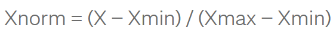

### Standartization (Standardizasyon)

Bu yöntemde değerler 0 ile 1 arasında kalmaya zorlamaz. Eksi ve artı işaretli farklı değerlerde ölçeklendirme yapabilir.

**NOT:** Pratik uygulamada her iki yönteminde denenmesinde fayda vardır.

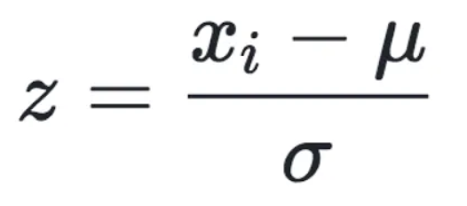

## Outlier

Outlier, diğer gözlemlerden aykırı ve sapan değerdir.

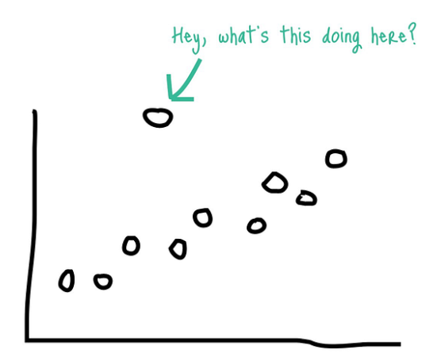

**Outlier’ın En Yaygın Sebepleri Nelerdir?**

**İnsan Hataları:** Veri girişi yapılırken 900.000 dolar yerine 9.000.000 dolar yazılması

**Cihaz Hataları:** Kilo, boy vs. aletleri ölçen cihazların birinin bozuk veya yanlış ölçüm yapması (örneğin ;58 kilo olan birinin 5.8 kilo ölçülmesi vs.)

**Deneysel Hatalar:**Yapılan deney veya anketlerde kişilerin yanlış cevap vermesi (gençlerin günde çözdüğü soru sayısı, içilen günlük alkol veya sigara miktarı vs.)

**Veri İşleme Hataları:** Veri kaynaktan alınırken veya manipülasyon yapılırken hata yapılmasıdır.

**Örneklem Hataları:** Türkiye’ de boy ölçüsü alınırken İskandinav boy ölçülerini alıp datasete ekleme veya basketbol oyuncularını datasete ekleme yanılgıya sebep olabilir.

**Doğal Sebep:** Bu sebep hata olarak alınmamakla birlikte doğal bir olaydır. Örneğin bir sınıfta her öğrencinin 50,60,65,53 aldığını bir öğrencinin çok çalışıp 100 aldığını söyleyebiliriz ve bu değeri hata olarak kabul etmeyiz.

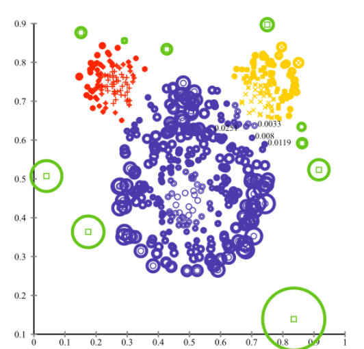

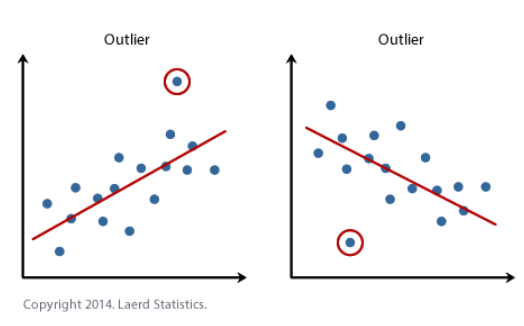

**NOT:** Aykırı Değer (Outlier) ve Geçersiz Değer (Invalid) arasındaki fark; Outlier, gerçek hayatta nadir olsa da gerçekleşebilir olan değerler iken Invalid, gerçek hayatta olması mümkün olmayan değerleri ifade eder. (Örneğin; Yaş: 1356)

**Outlier Tespiti**

1. Box Plot

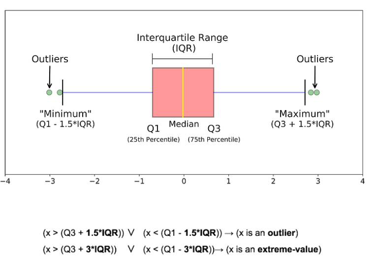

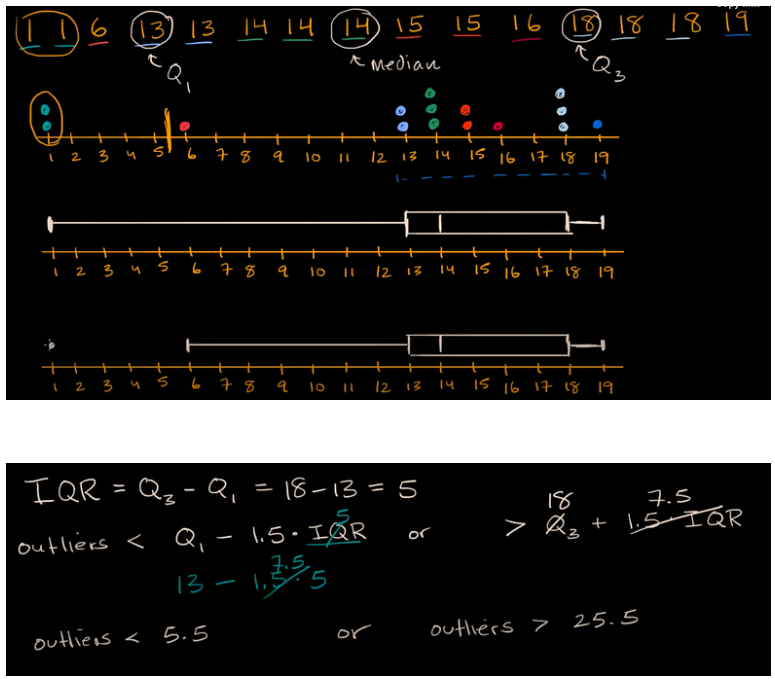

2. Standard Deviation (Standart Sapma)

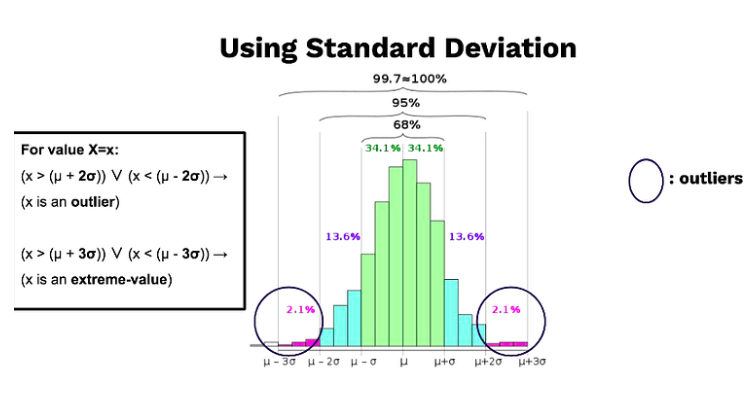

3. Z-Score

## Validation Methods

- **Holdout Method** ile verimizi gerçekten 2/3 train, 1/3 test olacak şekilde bölüyoruz ve verimizi bu şekilde eğitiyoruz. Random bir seçme işlemi oransal train test verisi elde etmemize yarar.
- **Repeated Holdout Method** ile yine bölme işlemi yapıyoruz ama bu sefer farklı yerlerden bölmeler yapıp ortalama bir başarı değeri elde ediyoruz. Yine de hala problemler mevcut. Sunum üzerinden okumasını yap. Overlapping problem ?
- **Cross Validation** yöntemi oldukça bilinen bir yöntem. Verimizi eşit parçalara bölüyoruz. Her bir parçayı bir defa test verisi olarak kullanarak hataları elde ediyoruz. En son hataların ortalamasını alıyoruz. Az data olması durumlarında tercih ediliyor. En yaygın olarak k=10 değeri ile kullanılıyor.
- **Stratified Ten-Fold Cross Validation** ise dağılımı dengeli bir veri setinde 10 parçalı bir cross validation yapmayı öneriyor.
- **Leave One Out Cross Validation** ise çok az verimiz olduğunda kullandığımız bir yöntem. Örneğin 100 verimiz olduğunda 99 train ve 1 test ayrımı yaparak ilerliyoruz. N kare karmaşıklık var.
- **Bootstrap** yöntemi ile tüm veriyi bölüyoruz. Böldüğümüz parçalardan rastgele seçim yapıyoruz. Ama seçtiğimiz parçayı bir daha seçebiliriz. En son hiç seçilmemiş olan parça veya parçaları test verisi olarak kullanıyoruz.

**NOT:** Amaç overfitting probleminden kaçınmak.

## Feature Selection (Özellik Seçimi)

1. Korelasyona Göre
2. Hipotez Testi İle
3. Regularization Methods (Lasso, Ridge)
4. Model eğitiminden sonra modele en çok katkı veren değişkenlerin seçilmesi ile 

## Feature Extraction (Özellik Çıkarma)

Feature Extraction yöntemi var olan özelliklerden yola çıkarak, var olan özelliklerin dışında yep yeni bir özellik oluşturmak anlamına gelir.

1. PCA

## Referanslar

* https://medium.com/@gulcanogundur/overfitting-a%C5%9F%C4%B1r%C4%B1-%C3%B6%C4%9Frenme-underfitting-eksik-%C3%B6%C4%9Frenme-ve-bias-variance-%C3%A7eli%C5%9Fkisi-b92bef2f770d
* https://miuul.com/not-defteri/encoding-nedir-turleri-nelerdir
* https://yigitsener.medium.com/makine-%C3%B6%C4%9Frenmesinde-normalizasyon-ve-standardizasyon-ile-python-uygulamas%C4%B1-9c55e3031e83
* https://medium.com/datarunner/outlier-analiz-y%C3%B6ntemleri-8ec0e63551f8
* https://machinelearningmastery.com/feature-selection-with-real-and-categorical-data/
