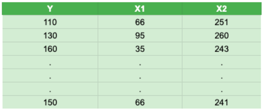
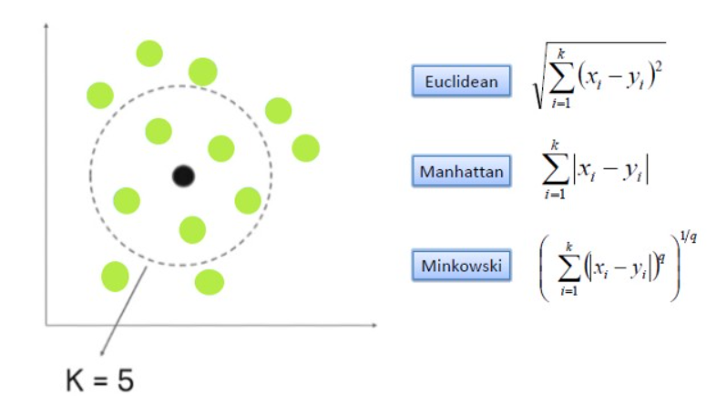
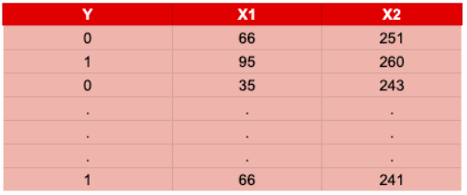
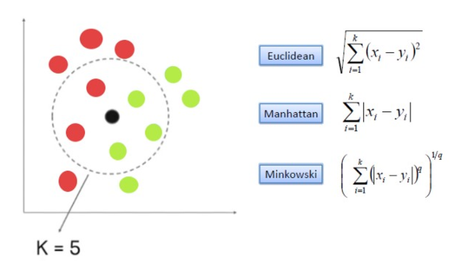

# KNN

## İçerik
- [KNN](#knn)
  - [İçerik](#i̇çerik)
  - [Giriş](#giriş)
  - [Regresyon problemlerinde KNN](#regresyon-problemlerinde-knn)
  - [Sınıflandırma problemlerinde KNN](#sınıflandırma-problemlerinde-knn)
  - [Önemli Notlar](#önemli-notlar)
  - [Referanslar](#referanslar)

## Giriş

K-en yakın komşu (k-nearest neighbors, KNN) algoritması, gözlemlerin birbirlerine olan benzerlikleri üzerinden tahminlerin yapıldığı gözetimli makine öğrenmesi modellerinde regresyon ve sınıflandırma problemlerinde kullanılan bir algoritmadır.

Bu algoritma kapsamında tahminde bulunmak istediğimiz gözlem birimine en yakın K adet farklı gözlem birimi tespit edilir ve bu K adet gözlem biriminin bağımlı değişkenleri üzerinden ilgili gözlem için tahminde bulunulur. Konuyu regresyon ve snıflandırma problemleri kapsamında birer örnekle detaylandıralım.

## Regresyon problemlerinde KNN

Bağımlı ve bağımsız değişkenin bir arada olduğu yukarıdaki örnek veri setinde, Y bağımlı değişkeni sayısal bir değişkendir. Dolayısıyla bir regresyon problemi ile karşı karşıyayız.

Herhangi bir X1 ve X2 değerine sahip gözlem birimi için Y bağımlı değişken tahmini yapılmak istendiğinde, öklid ya da benzeri bir uzaklık hesabı ile en yakın K adet gözlem birimi hesaplanarak bu gözlem birimlerinin bağımlı değişkenlerinin (Y değerlerinin) ortalaması alınır.

## Sınıflandırma problemlerinde KNN

Bağımlı ve bağımlı değişkenin bir arada olduğu yukarıdaki örnek veri setinde, Y bağımlı değişkeni sayısal görünmesine karşın binary encode edilmiş bir değişkendir. Dolayısıyla bir sınıflandırma problemi ile karşı karşıyayız.

Regresyon problemindekine benzer şekilde herhangi bir X1 ve X2 değerine sahip gözlem için Y bağımlı değişken tahmini yapılmak istendiğinde önce uzaklık hesabı yapılarak en yakın K gözlem birimi belirlenir. Ardından regresyon probleminden farklı olarak en yakın K adet gözlemin Y değerlerinin en sık gözlenen frekansı, tahmin edilen sınıf olarak belirlenir.

## Önemli Notlar

* En yakın komşu sayısı 1 olarak (k=1) kabul edilen durumda Voroni Diagra olarak tanımlanır ve sınırları ifade eden bir yapıdır aslında.
* KNN algoritması mesafeye dayalı bir algoritmadır. Bundan dolayı kullanılmadan önce verisetindeki değerlerin ölçeklendirilmesi gerekir. Bunun için normalization veya standardization uygulanabilir.
* KNN'de eğitimin yapılmaması ve hatalı verilerden çok etkilenmemesi öne çıkan özellikler olarak ifade edilebilir.
* KNN'de yürütme zamanında sürekli olarak hesap yapılması durumu vardır. Veri sayısının arttığı durumlarda yavaş çalışan bir yapı sorun oluşturabilir.
* En yakın kaç komşunun baz alınarak işlemlerin yapılacağı ise ayrı bir optimizasyon konusudur.

## Referanslar

* https://miuul.com/not-defteri/k-en-yakin-komsu-algoritmasi-nasil-calisir#:~:text=K%2Den%20yak%C4%B1n%20kom%C5%9Fu%20
* https://arslanev.medium.com/makine-%C3%B6%C4%9Frenmesi-knn-k-nearest-neighbors-algoritmas%C4%B1-bdfb688d7c5f  