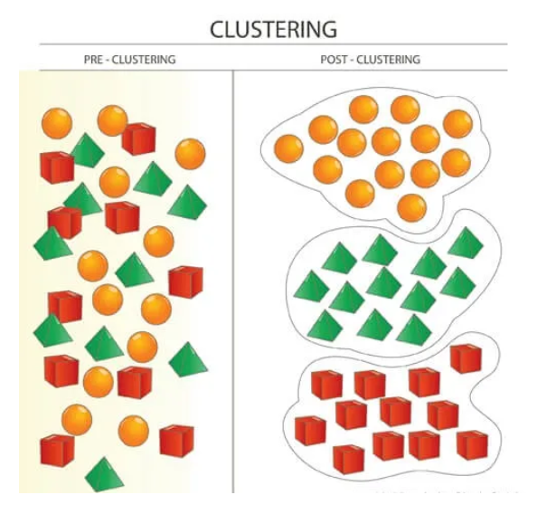
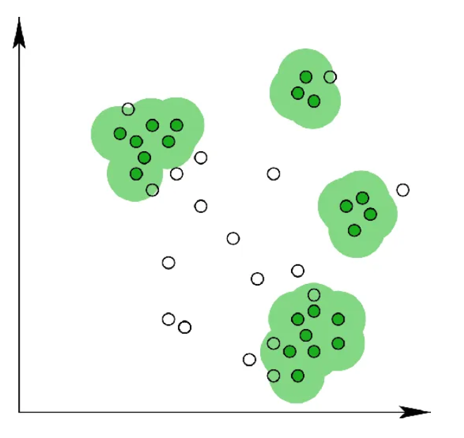
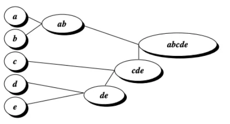
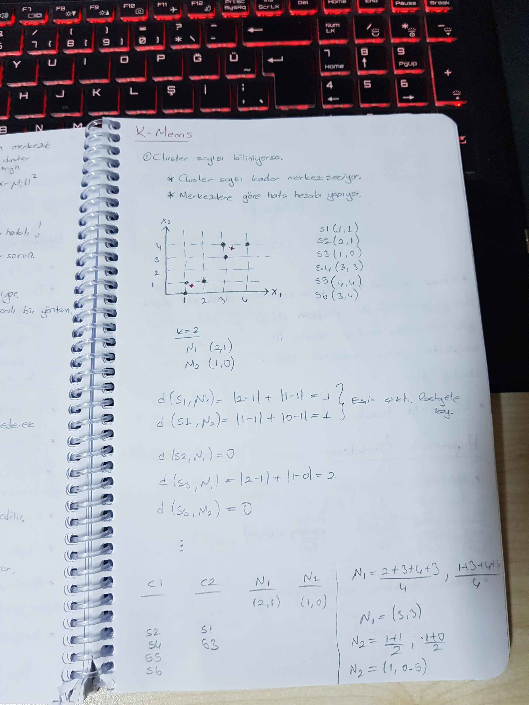

# K Means

## Contents
- [K Means](#k-means)
  - [Contents](#contents)
  - [Introduction](#introduction)
  - [Kullanım Alanları](#kullanım-alanları)
  - [Denetimsiz Öğrenim Kullanmanın Nedenleri](#denetimsiz-öğrenim-kullanmanın-nedenleri)
  - [Kümeleme Yöntemleri](#kümeleme-yöntemleri)
    - [Bölümleme yöntemleri(Partitioning methods)](#bölümleme-yöntemleripartitioning-methods)
    - [Hiyerarşik yöntemler(Hierarchical methods)](#hiyerarşik-yöntemlerhierarchical-methods)
    - [Yoğunluk bazlı yöntemler(Density-based methods)](#yoğunluk-bazlı-yöntemlerdensity-based-methods)
  - [YTÜ](#ytü)
  - [References](#references)

## Introduction

Kümeleme, verilerin yapısı hakkında bir sezgiyi elde etmek için kullanılan en yaygın keşifsel veri analizi tekniklerinden biridir. Farklı kümelerdeki veri noktaları çok farklıyken, aynı alt gruptaki (küme) veri noktalarının çok benzer olması nedeniyle verilerdeki alt grupların belirlenmesi görevi olarak tanımlanabilir. 

## Kullanım Alanları

* Belge Sınıflandırılması
* Suç Yerlerinin Belirlenmesi
* Müşteri Segmentasyonu
* Oyuncu Analizi
* Dolandırıcılık Tespiti
* Çağrı Kaydı Detay Analizi

K-Means algoritması bir unsupervised learning(gözetimsiz öğrenme) ve kümeleme algoritmasıdır.

> Denetimsiz öğrenme, modeli denetlemeniz gerekmeyen bir makine öğrenme tekniğidir. Bunun yerine, modelin bilgi keşfetmek için kendi başına çalışmasına izin vermeniz gerekir. Temel olarak etiketlenmemiş verilerle ilgilenir.Denetimsiz öğrenme algoritmaları, denetimli öğrenmeye kıyasla daha karmaşık işlem görevlerini gerçekleştirmenizi sağlar.

## Denetimsiz Öğrenim Kullanmanın Nedenleri

* Denetimsiz makine öğrenmesi, verilerde her türlü bilinmeyen kalıpları bulur.
* Denetimsiz yöntemler, kategorizasyon için faydalı olabilecek özellikleri bulmanıza yardımcı olur.
* Gerçek zamanlı olarak gerçekleşir, bu nedenle tüm girdi verileri öğrenilenlerin varlığında analiz edilir ve etiketlenir.
* Etiketlenmemiş verileri bilgisayardan elde etmek, elle müdahale gerektiren etiketli verilerden daha kolaydır.

## Kümeleme Yöntemleri

Kümelerin verilerden oluşturulma şekline bağlı olarak, farklı kümeleme yöntemleri olabilir. Kurumlar tarafından yoğun olarak kullanılan en popüler kümelenme tekniklerine bir göz atalım. Bu türler:

### Bölümleme yöntemleri(Partitioning methods)

Bölüm tabanlı kümeleme yöntemleri, verilen nesneleri, n boyutlu bir düzlemde rastgele veya belirli bazı nesnelerden uzaklıklarını ölçerek kümeler. Bu nedenle, bu yöntemler aynı zamanda mesafeye dayalı yöntemler olarak da bilinir.

### Hiyerarşik yöntemler(Hierarchical methods)

Hiyerarşik kümeleme yöntemleri, bölümleme yöntemlerinden farklıdır. Veri noktalarını benzerliklerine göre seviyelere / hiyerarşilere ayırırlar. Bu seviyeler birlikte ağaç benzeri bir yapı oluşturur (dendrogram). Bu bölünme iki şekilde gerçekleşebilir — yukarıdan aşağıya ve aşağıdan yukarıya.

### Yoğunluk bazlı yöntemler(Density-based methods)

Veri noktalarının mesafesini göz önünde bulundurmak yerine, yoğunluğa dayalı kümeleme yöntemlerinde, bir mahalle kümeleri oluşturduğu düşünülmektedir. Komşuluk, verilen verilerden bir küme oluşturmak için ilgilenilen bir bölgede (tipik olarak başka bir veri noktası) bulunması gereken buradaki veri noktalarının sayısını ifade eder.

## YTÜ

Eğer cluster sayısı biliniyorsa;
- Cluster sayısı kadar merkez seç.
- Merkezlere göre hata hesabı yap.
- Hata hesabına göre hangi clusterda olduğunu belirle.
- Noktaların ortalamasını alarak merkez güncellemesi yap.

*Elbow yöntemi* ile veri setinde kaç adet cluster olması gerektiği bulunabiliyor. Bu matematiksel bir yolla bulunuyor. Genel tabiriyle kırılma noktasındaki değer bizim cluster sayısını ifade ediyor.
*Hiyerarşik Öbekleme* min, max, avarage ve mean. Mean merkez uzaklık ortalamasına bakarak ilerler. Bölerek öbekleme, bölerek ilerleme olarak iki ayrı yol var.

## References

* https://medium.com/deep-learning-turkiye/k-means-algoritmas%C4%B1-b460620dd02a#:~:text=K%2DMeans%20algoritmas%C4%B1%20bir%20unsupervised,Temel%20olarak%20etiketlenmemi%C5%9F%20verilerle%20ilgilenir.
