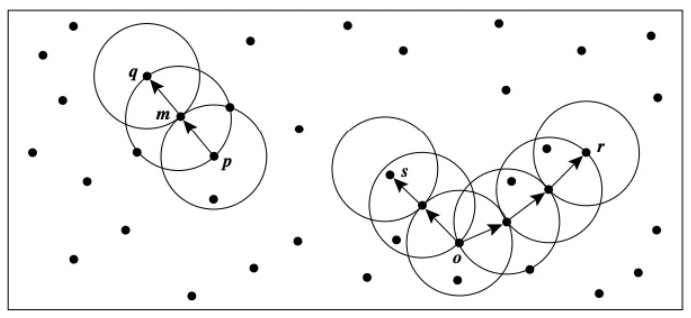

# K Means

## Contents
- [K Means](#k-means)
  - [Contents](#contents)
  - [Introduction](#introduction)
  - [Kullanım Alanları](#kullanım-alanları)
  - [Denetimsiz Öğrenim Kullanmanın Nedenleri](#denetimsiz-öğrenim-kullanmanın-nedenleri)
  - [Kümeleme Yöntemleri](#kümeleme-yöntemleri)
    - [Bölümleme yöntemleri(Partitioning methods)](#bölümleme-yöntemleripartitioning-methods)
    - [Hiyerarşik yöntemler(Hierarchical methods)](#hiyerarşik-yöntemlerhierarchical-methods)
    - [Yoğunluk bazlı yöntemler(Density-based methods)](#yoğunluk-bazlı-yöntemlerdensity-based-methods)
  - [Performance Measurements](#performance-measurements)
  - [YTÜ](#ytü)
  - [References](#references)

## Introduction

Kümeleme, verilerin yapısı hakkında bir sezgiyi elde etmek için kullanılan en yaygın keşifsel veri analizi tekniklerinden biridir. Farklı kümelerdeki veri noktaları çok farklıyken, aynı alt gruptaki (küme) veri noktalarının çok benzer olması nedeniyle verilerdeki alt grupların belirlenmesi görevi olarak tanımlanabilir. 

## Kullanım Alanları

* Belge Sınıflandırılması
* Suç Yerlerinin Belirlenmesi
* Müşteri Segmentasyonu
* Oyuncu Analizi
* Dolandırıcılık Tespiti
* Çağrı Kaydı Detay Analizi

K-Means algoritması bir unsupervised learning(gözetimsiz öğrenme) ve kümeleme algoritmasıdır.

> Denetimsiz öğrenme, modeli denetlemeniz gerekmeyen bir makine öğrenme tekniğidir. Bunun yerine, modelin bilgi keşfetmek için kendi başına çalışmasına izin vermeniz gerekir. Temel olarak etiketlenmemiş verilerle ilgilenir.Denetimsiz öğrenme algoritmaları, denetimli öğrenmeye kıyasla daha karmaşık işlem görevlerini gerçekleştirmenizi sağlar.

## Denetimsiz Öğrenim Kullanmanın Nedenleri

* Denetimsiz makine öğrenmesi, verilerde her türlü bilinmeyen kalıpları bulur.
* Denetimsiz yöntemler, kategorizasyon için faydalı olabilecek özellikleri bulmanıza yardımcı olur.
* Gerçek zamanlı olarak gerçekleşir, bu nedenle tüm girdi verileri öğrenilenlerin varlığında analiz edilir ve etiketlenir.
* Etiketlenmemiş verileri bilgisayardan elde etmek, elle müdahale gerektiren etiketli verilerden daha kolaydır.

## Kümeleme Yöntemleri

Kümelerin verilerden oluşturulma şekline bağlı olarak, farklı kümeleme yöntemleri olabilir. Kurumlar tarafından yoğun olarak kullanılan en popüler kümelenme tekniklerine bir göz atalım. Bu türler:

### Bölümleme yöntemleri(Partitioning methods)

Bölüm tabanlı kümeleme yöntemleri, verilen nesneleri, n boyutlu bir düzlemde rastgele veya belirli bazı nesnelerden uzaklıklarını ölçerek kümeler. Bu nedenle, bu yöntemler aynı zamanda mesafeye dayalı yöntemler olarak da bilinir. (K Means vb.)

### Hiyerarşik yöntemler(Hierarchical methods)

Hiyerarşik kümeleme yöntemleri, bölümleme yöntemlerinden farklıdır. Veri noktalarını benzerliklerine göre seviyelere / hiyerarşilere ayırırlar. Bu seviyeler birlikte ağaç benzeri bir yapı oluşturur (dendrogram). Bu bölünme iki şekilde gerçekleşebilir — yukarıdan aşağıya ve aşağıdan yukarıya. (PCA, Agglomerative clustring, DIANA vb.)

### Yoğunluk bazlı yöntemler(Density-based methods)

Veri noktalarının mesafesini göz önünde bulundurmak yerine, yoğunluğa dayalı kümeleme yöntemlerinde, bir mahalle kümeleri oluşturduğu düşünülmektedir. Komşuluk, verilen verilerden bir küme oluşturmak için ilgilenilen bir bölgede (tipik olarak başka bir veri noktası) bulunması gereken buradaki veri noktalarının sayısını ifade eder. (DBSCAN, OPTICS vb.)

## Performance Measurements

*True-Maching (TM):* Veri noktalarının gerçek sınıf etiketleri ile kümeleme mode- li ile bu veri noktaları için tahmin edilen kümelerin eşleşenlerinin toplam gözlem sayısına oranıdır. Diyelim 100 gözlem (veri noktası) ve bunların sınıf etiketleri bu- lunuyor. Bu gözlemlerin sadece özniteliklerinden yola çıkarak oluşturulan veri nok- talarıyla kümeleme tahmini yapıldığında aynı sınıf etiketine sahip olan gözlemler ile aynı kümede bulunan gözlemler eşleştirilir. Aynı sınıf ve kümeye ait olan gözlemle- rin tüm gözlemlere oranı TM'i verir.

*Adjusted Rand Index (ARI):* Veri noktalarının gerçek sınıf etiketleri biliniyorsa ya da özniteliklerden hareketle veri noktalarının hangi grup/kümenin elemanı olacağı ile ilgili beklenen sınıf etiketleri oluşturulmuşsa ARI gerçek ya da beklenen etiketleri ile K-Ortalamalar gibi kümeleme algoritması ile tahmin edilmiş grup/küme etiket- lerinin benzerliğini ölçmek için kullanılır.
-1 ile 1 arasında değer alır. Eksi değerler gerçek ya da beklenen değerler ile tahmin edilen değerlerin benzerlik göstermediğini; 1 bu değerlerin tam benzerlik gösterdi- ğini gösterir. ARI>0.60'ın üzeri kabul edilebilir seviyeler olduğu yönünde yaygın bir kanaat vardır.

*Mutual Information Score (MIS):* Veri noktalarının gerçek sınıf etiketleri bilini- yorsa MIS gerçek etiketleri ile K-Ortalamalar gibi kümeleme algoritması ile tahmin edilmiş grup/küme etiketlerinin benzerliğini ölçmek için kullanılır.
ARI'den farkı, beklenen değil sadece gerçek grup etiketleri varsa bunları kümeleme algoritmasının tahminleriyle karşılaştırarak değerlendirme yapmasıdır. Bu pratikte geçerli bir argüman değildir. Çünkü zaten kümeleme algoritmalarına veri noktaları- nın etiketleri bilinmediğinden başvurulur. MIS'in farklı Adjusted Mutual Informa- tion Score (AMI) ve Normalized Mutual Information Score (NMI) gibi versiyonları da bulunmaktadır.
O ile 1 arasında değer alır. O gerçek ve tahmin edilmiş etiketlerin örtüşmediğini; 1 ise bunların tam örtüştüğünü yani kümelerin doğru tahmin edildiğini gösterir.

*V-measure:* Veri noktalarının gerçek sınıf etiketleri biliniyorsa hesaplanır. İki saca-` yağı bulunmaktadır:

*Homojenlik (Homogenity):* Her bir küme aynı sınıf etiketine sahip veri noktala- rını barındırıyorsa tam homojen kümelemeden bahsedebiliriz. Böyle bir durumda kümeleme algoritması grupları doğru tanımlamış ve tahmin etmiş demektir. Ho- mojenlik skoru 0 ile 1 arasında değer alır. O homojen olmama durumunu, 1 ise tam homojenliği, yani aynı sınıf etiketine sahip verilerin aynı küme içinde tahmin edil- miş olduğunu gösterir.

*Eksiksizlik (Completeness):* Belli bir sınıf etiketine sahip tüm veri noktalarının aynı küme içinde, yani fire vermeden eksiksiz bir şekilde, tahmin edilmesini ifade eder. Böyle bir durumda yine kümeleme algoritması grupları doğru tanımlamış ve tah- min etmiş demektir. Eksiksizlik skoru 0 ile 1 arasında değer alır. O eksikliliği, 1 ise tam eksiksizliği, yani gerçekte aynı sınıf etiketine sahip verilerin aynı kümeye ait olduğunu gösterir.
V-Measure ise bir kümeleme modeli tahmin sonuçlarının gerçek değerlerle karşı- laştırılması sonucunda elde edilen Homojenlik ve Eksiksizlik skorlarının harmonik ortalamasıdır. O ile 1 arasında değer alan V-Measure ölçütünün l'e yakın olması ar- zulanır. Pratikte 0,7'nin üzerinde olması kümeleme tahminin kalitesini gösterir.
Vmeasure = (1+ B) x Homojenlik × Eksiksizlik Bx Homojenlik × Eksiksizlik
Burada ẞ homojenlik ve eksiksizlik için belirlediğimiz bir ağırlık katsayısıdır. sklearn kütüphanesinde bu ağırlık 1 olarak verilmiştir. Uygulayıcı veri tipi ve analizin gidi- şatına göre değiştirilebilir. Homojenliğe eksiksizlikten daha fazla ağırlık verileceği zaman l'den yüksek bir ẞ değeri (örneğin, 1,5) verilirken tersine eksiksizliğe daha fazla ağırlık verilmek istendiğinde daha düşük bir değer (örneğin 0,7) verilir.

--- 

*Silhouette Metodu:*
Silhouette Katsayısı = (b- a)/max(a,b)
a= küme içi ortalama mesafe (bir kümenin içindeki tüm veri noktalarının birbirleri arasındaki ortalama mesafe)
b= kümeler arası ortalama mesafe (tüm kümelerin arasındaki mesafelerin ortalaması)

Siluet katsayısı ya da skoru kümelenmenin ne kadar iyi yapıldığını ölçen bir göstergedir. -1 ile 1 arasında değer alır. Buna göre,

-1: kümelerin veri noktalarını iyi ifade edemediğini, grupları yanlış
tanımladığını;
0: kümelerin birbiriyle alakasız bir şekilde oluşturulduğunu aralarındaki mesafenin anlamsız olduğunu;
1: kümelerin veri noktalarını tamamen ayrıştıracak şekilde oluşturulduğunu, yani, kümelerin doğru oluştuğunu ve veri gruplarını doğru tanımladığını gösterir.

Pozitif Silhouette katsayısı asıl odaklanılması gereken olduğundan O'dan büyük katsayıların pratikte yorumlanması şu şekildedir: 0.71-1.0: İyi. Kümeler güveni- lir bir şekilde ayrılmış; 0.51-0.70: Kabul edilebilir; 0.26-0.50: Küme yapılarının ayrışması çok zayıf ya da rassaldır. Başka bir algoritma denenebilir; < 0.25: Üre- tilen kümeler güvenilir değil.

*Elbow (Dirsek) Metodu:* l'den başlayarak birer birer artacak şekilde K (küme sayısı) seçilir. Her bir K sayısı için veri noktaları arasından rastgele küme merkezleri (cent- roid) seçilir. Tüm veri nokralarının da bu küme merkezlerine mesafeleri hesaplanır. Bu hesaplamada yaygın olarak «distortion>> ya da «inertia,>> hata skoru hesaplamaları kullanılır. Netice itibari ile sonucu etkilemez.

*Distortion:* Veri noktalarının en yakın küme merkezine olan uzaklıklarının karele- rinin ortalaması.

*Inertia:* Veri noktalarının en yakın küme merkezine olan uzaklıklarının karelerinin toplamı.
Veri noktaları en yakın oldukları merkezlerine, en yakın oldukları kümelere atanır- lar. Bu işlem iteratif, yani sürekli, tekrarlanır. Küme merkezleri artık değişmediğinde iterasyon (tekrar tekrar deneme işlemi) durur.
380

## YTÜ

Eğer cluster sayısı biliniyorsa;
- Cluster sayısı kadar merkez seç.
- Merkezlere göre hata hesabı yap.
- Hata hesabına göre hangi clusterda olduğunu belirle.
- Noktaların ortalamasını alarak merkez güncellemesi yap.

*Elbow yöntemi* ile veri setinde kaç adet cluster olması gerektiği bulunabiliyor. Bu matematiksel bir yolla bulunuyor. Genel tabiriyle kırılma noktasındaki değer bizim cluster sayısını ifade ediyor.
*Hiyerarşik Öbekleme* min, max, avarage ve mean. Mean merkez uzaklık ortalamasına bakarak ilerler. Bölerek öbekleme, bölerek ilerleme olarak iki ayrı yol var.

## References

* https://medium.com/deep-learning-turkiye/k-means-algoritmas%C4%B1-b460620dd02a#:~:text=K%2DMeans%20algoritmas%C4%B1%20bir%20unsupervised,Temel%20olarak%20etiketlenmemi%C5%9F%20verilerle%20ilgilenir.
