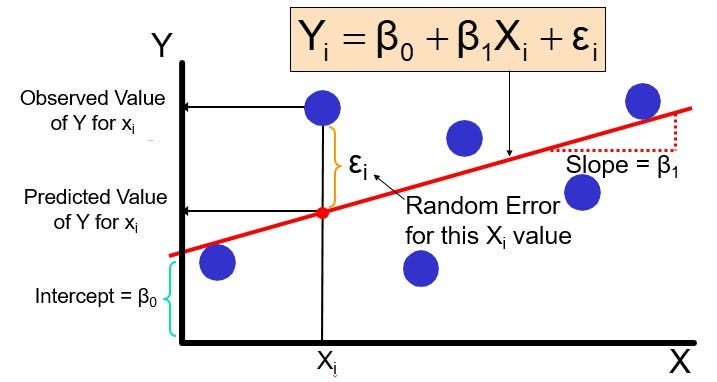

# Linear Regression

# İçerik
- [Linear Regression](#linear-regression)
- [İçerik](#i̇çerik)
- [Tanımlama](#tanımlama)
- [Doğrusal regresyondaki basamaklar](#doğrusal-regresyondaki-basamaklar)
- [Regresyon Türleri](#regresyon-türleri)
  - [Basit doğrusal regresyon](#basit-doğrusal-regresyon)
  - [Çoklu doğrusal regresyon](#çoklu-doğrusal-regresyon)
  - [Lojistik regresyon](#lojistik-regresyon)
- [Gradient Descent](#gradient-descent)
- [Referanslar](#referanslar)

# Tanımlama

Doğrusal regresyon, ilgili ve bilinen başka bir veri değeri kullanarak bilinmeyen verilerin değerini tahmin eden bir veri analizi tekniğidir. Bilinmeyen veya bağımlı değişkeni ve bilinen veya bağımsız değişkeni doğrusal bir denklem olarak matematiksel olarak modeller. Örneğin, geçen yılki harcamalarınız ve geliriniz hakkında verileriniz olduğunu varsayalım. Doğrusal regresyon teknikleri bu verileri analiz eder ve giderlerinizin gelirinizin yarısı olduğunu belirler. Daha sonra gelecekteki bilinen bir geliri yarıya indirerek bilinmeyen bir gelecekteki gideri hesaplarlar.

# Doğrusal regresyondaki basamaklar
Bu genel bakış için y ve x arasındaki çizgi grafiği denkleminin en basit şeklini göz önünde bulundurun; y=c*x+m denkleminde c ve m, x ve y'nin olası tüm değerleri için sabittir. Örneğin (x, y) için giriş veri kümesinin (1,5), (2,8) ve (3,11) olduğunu varsayalım. Doğrusal regresyon yöntemini tanımlamak için aşağıdaki adımları uygularsınız:

* Düz bir çizgi çizin ve 1 ile 5 arasındaki bağıntıyı ölçün.
* Tüm değerler uyana kadar yeni değerler (2,8) ve (3,11) için düz çizginin yönünü değiştirmeye devam edin.
* Doğrusal regresyon denklemini y=3*x+2 olarak tanımlayın.
* x olduğunda y'nin de 14 olduğunu sonucuna ulaşın veya tahmininde bulunun

|Değişken|Açıklama|
|-|-|
|Y|Hedef değişken|
|X|Girdi değişken|
|B0|Bias değeri (Doğrunun Y eksenini kestiği nokta)|
|B1|Girdi değişken katsayısı|
|£i|Hata kat sayısı|

* B1 ve B0 değerlerini optimize ederek verilen noktalara uygun en az hata değeri sahip doğruyu bulmak temel hedeftir.

# Regresyon Türleri

## Basit doğrusal regresyon

Basit doğrusal regresyon doğrusal fonksiyon ile tanımlanır:

Y= β0*X + β1 + ε 

β0 ve β1 regresyon eğimini temsil eden iki bilinmeyen sabitken, ε (epsilon) bir hata terimidir.

Bunlar gibi iki değişken arasındaki ilişkiyi modellemek için basit doğrusal regresyon kullanabilirsiniz:

* Yağış ve mahsul verimi
* Çocuklarda yaş ve boy
* Bir termometrede metal cıva sıcaklığı ve genleşmesi

## Çoklu doğrusal regresyon

Çoklu doğrusal regresyon analizinde, veri kümesi bir bağımlı değişken ve birden çok bağımsız değişken içerir. Doğrusal regresyon çizgisi fonksiyonu aşağıdaki gibi daha fazla faktör içerecek şekilde değişir:

Y= β0*X0 + β1X1 + β2X2+…… βnXn+ ε 

Tahmin unsuru değişkenlerinin sayısı arttıkça, β sabitleri de buna bağlı olarak artar.

Çoklu doğrusal regresyon, birden çok değişkeni ve bunların bir sonuç üzerindeki etkisini modeller:

* Mahsul veriminde yağış, sıcaklık ve gübre kullanımı
* Kalp hastalığında diyet ve egzersiz
* Ücret artışı ve konut kredisi oranlarında enflasyon

## Lojistik regresyon

Veri bilimcileri, bir olayın meydana gelme olasılığını ölçmek için lojistik regresyonu kullanır. Tahmin, 0 ile 1 arasında bir değerdir; burada 0, gerçekleşmesi muhtemel olmayan bir olayı gösterir ve 1, bunun gerçekleşme olasılığının maksimum olduğunu gösterir. Lojistik denklemler, regresyon çizgisini hesaplamak için logaritmik fonksiyonları kullanır.

Şunlar birkaç örnektir:

* Bir spor karşılaşmasında galibiyet veya mağlubiyet olasılığı
* Bir testi geçme veya testte başarısız olma olasılığı 
* Bir görüntünün meyve veya hayvan olma olasılığı

# Gradient Descent

# Referanslar

* https://scikit-learn.org/stable/modules/generated/sklearn.linear_model.LinearRegression.html
* https://aws.amazon.com/tr/what-is/linear-regression/
* 