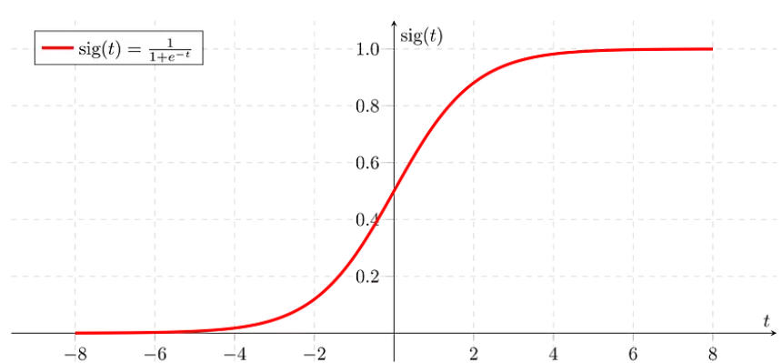

# Logistic Regression

## Contents
- [Logistic Regression](#logistic-regression)
  - [Contents](#contents)
  - [Requirements](#requirements)
  - [Introduction](#introduction)
  - [Sigmoid Function](#sigmoid-function)
  - [Advantages](#advantages)
  - [Disadvantages](#disadvantages)
  - [Conclusion](#conclusion)
  - [References](#references)

## Requirements

## Introduction

Lojistik regresyon, isminde “regresyon” geçmesine rağmen bir sınıflandırma algoritmasıdır. Yani görseldeki hayvanın kedi mi, köpek mi olduğu veya verilmiş olan bilgilerin bir erkeğe mi yoksa bir kadına mı ait olduğunu tahmin etme gibi iki sınıflı sınıflandırma problemlerinde sıkça kullanılır.

Lojistik regresyonun, lineer regresyon ile arasındaki en büyük farkı iki sınıfı birbirinden ayıracak çizgiyi nasıl uyguladığıdır (fit). Lineer regresyon, optimum çizgiyi çizmek için “En Küçük Kareler Yöntemi” (Least Squares) kullanırken, lojistik regresyon “Maksimum Olabilirlik” (Maximum Likelihood) kullanır.

Lojistik regresyon, sınıflandırma yapmak için Sigmoid (Lojistik) Fonksiyonu kullanır. Sigmoid fonksiyonu “S” şeklinde bir eğridir.

## Sigmoid Function

Sigmoid fonksiyonu basitçe, verilerimizi 0 ve 1 arasına sıkıştırmak için kullanılan fonksiyondur. Bu fonksiyon sayesinde sınıflandırma yapabiliriz. Derin Öğrenme içerisinde aktivasyon fonksiyonları altında da sıkça kullanılır.

## Advantages

* Lojistik regresyonun uygulanması, yorumlanması kolaydır.
* Veri seti doğrusal olarak ayrılabiliyorsa oldukça iyi performans gösterir.
* Overfitting’e daha az meyillidir ama büyük veri setlerinde overfit olabilir.

## Disadvantages

* Gözlem sayısı özellik sayısından azsa, Lojistik Regresyon kullanılmamalıdır, aksi takdirde overfit olabilir.
* Lojistik regresyonun ayrım yapabilmesi için veri setinin doğrusal olarak ayrılabiliyor olması lazım.

## Conclusion

Lojistik regresyon, kategorik bir bağımlı değişkenin olasılığını tahmin etmek için kullanılan denetimli bir makine öğrenimi sınıflandırma algoritmasıdır. Bağımlı değişken, ikili sınıflandırıcı (regresyonda değil) olarak kullanılan 1 (evet/doğru) veya 0 (hayır/yanlış) olarak kodlanmış verileri içeren ikili bir değişkendir. Lojistik regresyon, sürekli ve ayrık değişkenler ve doğrusal olmayan özellikler dahil olmak üzere çok sayıda özellikten yararlanabilir. Lojistik regresyonda Sigmoid (diğer adıyla Lojistik) fonksiyonu kullanılır.

## References

* https://mfakca.medium.com/lojistik-regresyon-nedir-nas%C4%B1l-%C3%A7al%C4%B1%C5%9F%C4%B1r-4e1d2951c5c1
* https://bulutistan.com/blog/lojistik-regresyon-nedir/ 
