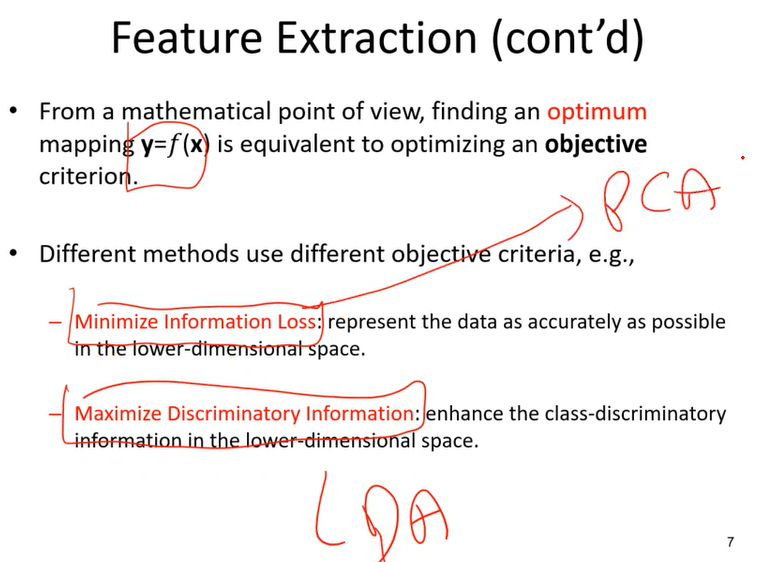

# Principal Component Analysis (Temel Bileşen Analizi)

## Content

- [Principal Component Analysis (Temel Bileşen Analizi)](#principal-component-analysis-temel-bileşen-analizi)
  - [Content](#content)
  - [Introduction](#introduction)
  - [YTÜ](#ytü)
  - [References](#references)

## Introduction

PCA'nin kümeleme, öznitelik seçimi(feature selection) ve boyut azaltma (dimentionality reduction) gibi makine öğrenmesi tekniği açısından üç önemli işlevi vardır.

Boyut Azaltma (Dimensionality Reduction) veri bilimi için oldukça önemli bir yöntem. Başlıca sebepleri şöyle:

* Gerçek hayattaki veriler çok fazla boyuta (özniteliğe) sahip oluyor ve boyut büyüdükçe veri temizlemeden model kurmaya bütün süreçlerde harcamamız gereken zaman ve kaynaklar artıyor.
* Ne kadar çok boyuta sahip olursak görselleştirme de o kadar zor oluyor. 3 boyuttan sonrasını hayal etmek zor ama görsel olarak da yaptığımız çalışmanın bir karşılığı olsun insanlara anlatalım istiyoruz.
* Hemen her veri setinde bazı öznitelikler arasında yüksek korelasyon oluyor ve bu bizim gereksiz bilgiye sahip olmamıza ve modelimizde overfitting problemine sebep olabiliyor.
* 
> PCA (Principal Component Analysis) methodu yüksek boyutlu bir veri setinin boyutunu azaltmak için kullanılan en yaygın yöntemlerden biri.

Boyut küçültmenin en kolay yolu verimizi en iyi tanımlayan öznitelikleri bulup diğerlerini atmaktır (öznitelik seçimi — feature selection). Örneğin 100 boyuttan 10 tanesinin önemli olduğunu belirleyip kalan 90 özniteliği atmak ama bu tahmin edeceğiniz gibi bilgi kaybına sebep oluyor.

Bizim uğraşmamız gereken şey ise öznitelik çıkarımı (feature extraction) yapmak -en az bilgi kaybıyla boyut küçültmek-. Bunu yapmak için verideki dağılımın maksimum varyansını-bilgisini tutan minimum sayıda değişken oluşturuyoruz. Eğer bir değişken her örnek için aynı değere sahip ise gereksiz bir değişkendir. Biz en yüksek varyansa sahip olan değişkenleri bulmalıyız. Buna en güzel örneklerden biri HDI (İnsani Kalkınma Endeksi) hesaplaması olabilir. Ülkelerin sahip olduğu değişkenlerden bazıları (wiki): resmi dil, yüz ölçümü (toplam), su oranı, nüfus, nüfus yoğunluğu, GSYH, para birimi, trafik akışı, hukuk, dış ilişkiler, din, eğitim, sağlık, sanayi, tarım, turizm…

Yukarıdakine ek olarak ülkeden ülkeye değişen yüzlerce değişken sıralayabiliriz. PCA metodu sanayi, tarım, turizm vs. ekonomiyle ilgili yüzlerce değişkeni ve nüfusu kullanıp kişi başına düşen gayri safi milli gelir diye tek bir değişken oluşturuyor. Yani yüzlerce boyutluk bilgi en az bilgi kaybıyla tek boyutta tutulmuş oluyor.

> **Özetle temel hedef**, veri setini en iyi seçilde temsil edebilecek daha az sayıda yeni değişken (feature extraction) üretebilmektir. Bunu yaparkende bilgi kaybının en az seviyede olmasını hedeflenir.

## YTÜ

PCA, mümkün olan en az bilgi kaybı ile uygun vektör veya doğru indirgemesi yapmaya çalışan bir yöntemdir. Daha düşük bir boyuta aktarım yaparken, mümkün olan en az bilgi kaybı ile bu işlemi gerçekleştirmek PCA yönteminde hedeflenendir.

PCA, iz düşümlerine özel bir ad veriyor ve Principal Commponent diyor. İz düşüm vektörleri aslında. Bu PC’leri nasıl bulacağız.

Verilerimiz aslında matris formatındadır. Bu bağlamda düşünerek bir gösterim yapmak mümkündür. Aşağıda bir veri setini temsilen bir matris çizilmiştir. Sütunlar veri setinin özelliklerini ifade ederken, satırlar herbir veriyi ifade etmektedir.

Temel hedefimiz eldeki verileri ve değişkenleri kullanarak yep yeni değişkenler türetmektir. Bu işlemi yaparken de yeni türetilen değişkenlerin veri setini en iyi şekilde açıklaması beklenir. Bunun için bilgi kaybı değerinin küçük olması hedeflenir.

**Feature Extraction**

Giriş Seviye İşlem Adımları:
- Ortalama vektörü bul.
- Her özelliğin değerinden ortalama değeri çıkar. Bu sayede veri değerlerinde değişiklik yapmadan verimizi orijine taşımış oluyoruz.
- Normalizasyon (standardizasyon) işlemi yapmak. Feature’lar arasında sayısal büyük farklar olabiliyor. Bunu ortadan kaldırmak için normalizasyon işlemi yapmamız gerekiyor.
- Bu adımlardan sonra uygun bir veri seti elde ediyoruz. Bundan sonra amaç principal component doğrularını nasıl bulacağımızdır.

Varyasın en büyüğünü her zaman birinci PC sağlar. Baştakiler en iyi PC sağlayanlar. Git gide küçülüyor. Baştaki PC’ler zaten %95 veri temsili sağlıyor mesela. Bu sayede özellik düşürme sağlayabiliyoruz.

PCA, unsupervised bir yöntem. Etiketsiz veride lineer olarak temsil işlemi yapmaya yarıyor. Oldukça temel bir yöntem. Birçok veri setinde kullanılabiliyor. Lakin her veri seti için uygun olmayabilir. Bunun için farklı özellik indirgeme (otoencoder vb.) yöntemleri kullanılabilir.
PCA, sadece nümerik verilerde kullanılır. Kategorik vb. olanlarda kullanılmaz.
PCA, çok boyutluluk problemi varsa işe yarar. Özellik sayımız zaten az ise çok bir anlamı yok.
PC’ler azalan varyans olarak sıralanıyor. Temel prensibi bu. Peki bu nasıl çalışıyor ?

Verimizi orijine getirdik diyelim. Bunu ortalama değerlerden çıkararak yapabiliyorduk. Sonrasında bir doğruyu döndürerek, en az bilgi kaybını sağlayan doğru bulunabilir.
PC üzerindeki bilgi kaybının minimize olması, PC varyansının maksimize olmasını sağlıyor.
Biz varyansı maksimize etme üzerine bakıyoruz. Buradan kovaryans matrisine bir bağlantı olacak.

Orijinal A matrisimiz vardı. Bu PCA için 2 ön işlemden geçirdik. Ortalama değerlerinden çıkardık ve normalize ettik. Sonrasında kovaryans matrisi elde etmek için A x A(Transpoz) çarpımı yapıyoruz. Elde ettiğimiz kovaryans matrisinin  eigen value ve eaigen vektörlerine elde ettiğimizde varyans değerlerine(yüksek varyanstan düşük varyansa doğru) göre PC’leri elde etmiş oluyoruz.
PC’ler bir birine dik. Bu da PC1’in varyansının PC2’den yüksek olacağını bize garanti ediyor.
Öyle bir PC sayısı seçelim ki, tüm özellikleri %95 oranında temsil edebilsin. Çünkü son PC’lerin varyansı çok küçüktür.

Şimdi İşlem Adımları;

- Verinin özelliklerinin ortalama değerlerini bul.
- Herbir değerden ortalama değerini çıkar.
- Veriyi normalize et.
- Varyans Kovaryans matrisini bul. (Örneğin A matris çarpımı A matrisinin transpozu)
- Verinin eigen value ve eigen vektörlerini bul.
- Eigen value’lara göre sıraladığımız zaman zaten PC’leri bulmuş oluyoruz.
- En uygun adet PC seçilerek, daha az özellikle veri temsili işlemi gerçekleştirilmiş oluyor.

PC bir unit vektördür. Karesine bölünmüş hali yani. Yönü falan aynı. Lakin 1’den küçük değerlerden oluşur.

**Eigen Value and Eigen Vector**

Eigen Value ve Eigen Vector değerlerinin nasıl bulunacağına dair temel bir örnek aşağıda verilmiştir.

## References

* https://medium.com/@gulcanogundur/pca-principal-component-analysis-temel-bile%C5%9Fenler-analizi-bf9098751c62
* https://avesis.yildiz.edu.tr/17212