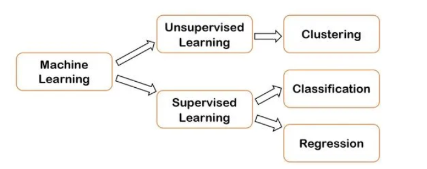
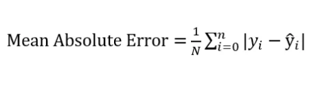
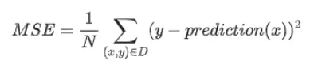
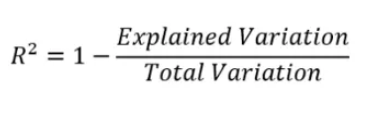

# Performance Evaluation Metrics

## İçerik
- [Performance Evaluation Metrics](#performance-evaluation-metrics)
  - [İçerik](#i̇çerik)
  - [Giriş](#giriş)
  - [Regresyon Modellerinin Değerlendirilmesi](#regresyon-modellerinin-değerlendirilmesi)
    - [Mean Absolute Error(MAE)](#mean-absolute-errormae)
    - [Mean Squared Error(MSE)](#mean-squared-errormse)
    - [Root Mean Squared Error(RMSE)](#root-mean-squared-errorrmse)
    - [R²](#r)
    - [Adjusted R²](#adjusted-r)
  - [Referanslar](#referanslar)

## Giriş

Makine Öğrenimi algoritmaları, belirli bir durum için kullanılır ve benzer durumdaki bilinmeyenler için sonuç tahmin etmek için kullanır. Bu algoritmalar aslında problemi çözmek için kullanır. Bu problemlerden ikisi regresyon ve sınıflandırma problemleridir.

**Regresyon**, temel olarak değişkenler arasındaki ilişkiyi bulmak için istatistiksel bir yaklaşımdır. Makine öğreniminde, veri kümesinden elde edilen değişkenler arasındaki ilişkiye dayalı olarak bir olayın sonucunu tahmin etmek için kullanılır.

**Sınıflandırma**, veri öğelerinin ait olduğu sınıfı belirtir ve çıktıda sonlu ve ayrık değerler olduğunda kullanılır. Bir giriş değişkeni için bir sınıf öngörür. Bir veya daha fazla girdi verildiğinde, bir sınıflandırma modeli bir veya daha fazla sonucun değerini tahmin etmeye çalışacaktır.



Görüldüğü üzere aslında regresyon ve sınıflandırma ikisi de denetimli öğrenme modelidir. Yani her ikisi de tahmin yapmak için etiketlenmiş eğitim veri kümelerini kullanır. Bir başka deyişle denetimli öğrenme algoritmaları, hedef tahmin çıktısı ile girdi özellikleri arasındaki ilişkileri ve bağımlılıkları modellemeye çalışır. Böylece önceki veri kümelerinden öğrendiği ilişkilere dayanarak yeni veriler için çıktı değerlerini tahmin edebiliriz. 

**Bir regresyon modeli** sürekli değerleri öngörür. Örneğin, regresyon modelleri aşağıdaki gibi soruları cevaplayan tahminlerde bulunur:

* Aydın’da bir evin değeri nedir?
* Bir kullanıcının bu reklamı tıklama olasılığı nedir?

**Bir sınıflandırma modeli** kategorik değerleri öngörür. Örneğin, sınıflandırma modelleri aşağıdaki gibi soruları cevaplayan tahminlerde bulunur:

* Belirli bir e-posta iletisi spam mi yoksa spam değil mi?
* Bu bir köpek, kedi veya bir hamster görüntüsü mü?

## Regresyon Modellerinin Değerlendirilmesi

### Mean Absolute Error(MAE)

Mutlak hata, tahmin edilen değerler ile gerçek değerler arasındaki farktır. Tam olarak ifade etmek gerekirse, veri kümesinin tüm örneğinde, o örnek için gerçek değer ile öngörülen değer arasındaki her bir farkın mutlak değerinin ortalamasıdır.



* y, gerçek değerdir.
* y^ tahmin edilen değerdir.

> Düşük bir değer daha iyi doğruluğu gösterir.

```py
from sklearn.metrics import mean_absolute_error
mean_absolute_error(y_true, y_pred)
```

### Mean Squared Error(MSE)

Ortalama Kare Hatası (MSE) en sık kullanılan regresyon kaybı fonksiyonudur. MSE, tüm veri kümesinde örnek başına ortalama kare kaybıdır. MSE’yi hesaplamak için, tek tek örnekler için tüm kare kayıplarını toplayın ve daha sonra örnek sayısına bölün.



* x, modelin tahminde bulunmak için kullandığı özelliktir.
* prediction(x) anlamı, x özelliğine göre tahmin edilen değerdir.
* y, gerçek değerdir.
* N, örnek sayısıdır.

> Düşük bir değer daha iyi doğruluğu gösterir.

```py
from sklearn.metrics import mean_squared_error
mean_squared_error(y_true, y_pred)
```

> Kare nedeniyle, büyük hataların MSE üzerinde küçük hatalardan daha fazla etkisi vardır. Bu nedenle MAE, kareden faydalanmadığı için aykırı değerlere karşı daha sağlamdır.

> Verilerde aykırı değer varsa ve bunları yok saymak istiyorsanız, MAE daha iyi bir seçenektir ancak bunları kayıp fonksiyonunuzda hesaba katmak istiyorsanız MSE / RMSE’ye gidin.

### Root Mean Squared Error(RMSE)

Ortalama Kare Hatasının kökünün alınmış değerini ifade eder.


### R²

R², verilerin yerleştirilmiş regresyon hattına ne kadar yakın olduğunun istatistiksel bir ölçüsüdür. Ayrıca belirleme katsayısı veya çoklu regresyon için çoklu belirleme katsayısı olarak da bilinir. Daha basit bir dilde söylemek gerekirse R-kare, doğrusal regresyon modelleri için uygunluk ölçüsüdür.

Aynı veri seti için, daha yüksek R-kare değerleri, gözlemlenen veriler ve fit edilen değerler arasında daha küçük farkları temsil eder.



> R-kare, bir regresyon modelinin verilerinize yeterli bir uyum sağlayıp sağlamadığını göstermez. İyi bir model düşük bir R-kare değerine sahip olabilir. Öte yandan, taraflı bir model yüksek bir R-kare değerine sahip olabilir!

Örneğin bazı çalışma alanları, doğası gereği daha fazla miktarda açıklanamayan varyasyona sahiptir. Bu alanlarda, R-kare değerleriniz daha düşük olmak zorundadır. Mesela insan davranışını açıklamaya çalışan çalışmalar genellikle % 50'nin altında R-kare değerlerine sahiptir. İnsanları tahmin etmek, fiziksel süreçler gibi şeylerden daha zordur.

Model için R-kare’nin ne kadar yüksek olması yararlı tahminler üretir? Bu, ihtiyaç duyduğunuz hassasiyete ve verilerinizde bulunan varyasyon miktarına bağlıdır. Kesin tahminler için yüksek bir R-kare gereklidir ancak yüksek R-kare değerleri her zaman mükemmel mi?

Hayır! Yüksek R-kare değerine sahip bir regresyon modelinde çok sayıda sorun olabilir. Örneğin, ‘overfitting’ durumunda yüksek R-kare değerlerine ulaşabilirsiniz.

R-kare oldukça basit görünen aslında derinliklerine inilmesi gereken bir metriktir.

```py
from sklearn.metrics import r2_score
sklearn.metrics.r2_score(y_true, y_pred)
```


### Adjusted R²

Bir modele eklenen her ek bağımsız değişken her zaman R² değerini artırır.

> Bağımsız değişken eklendikçe model karmaşıklaşır, model karmaşıklaşınca ‘overfitting’ ortaya çıkar. Dolayısıyla R-kare artar.

Bu tarz problemlere çözüm olması için Ayarlanmış R-kare devreye girer. Ayarlanmış R-kare, her bir bağımsız değişkeni telafi eder ve yalnızca verilen her değişken, modeli mümkün olanın üstünde geliştirdiğinde artar.

```py
# n = örnek boyutu sayısı
# p = bağımsız değişken sayısı
adj_r2 = 1-(1-R2)*(n-1)/(n-p-1)
```


## Referanslar

* https://medium.com/deep-learning-turkiye/model-performans%C4%B1n%C4%B1-de%C4%9Ferlendirmek-metrikler-cb6568705b1
