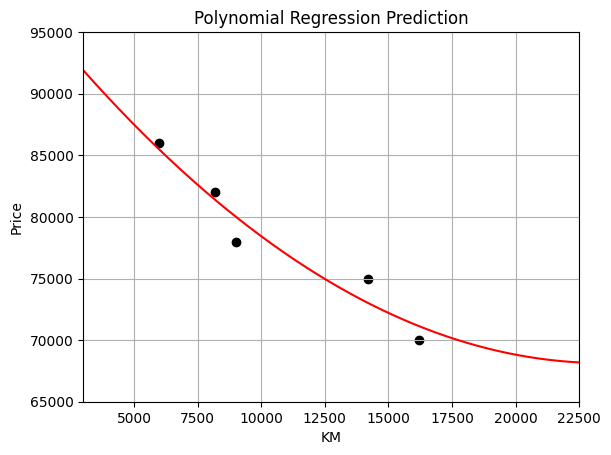

# Polynomial Regression

# İçerik
- [Polynomial Regression](#polynomial-regression)
- [İçerik](#i̇çerik)
- [Tanım](#tanım)

# Tanım

Bağımlı değişken “x” ve bağımsız değişken “y” değerlerinin ilişkisini doğrusal olmayan olarak modelleyen bir regresyon analizi türüdür. Verilere doğrusal olmayan bir model sığdırsa da, çoklu doğrusal regresyonun özel bir durumudur.

