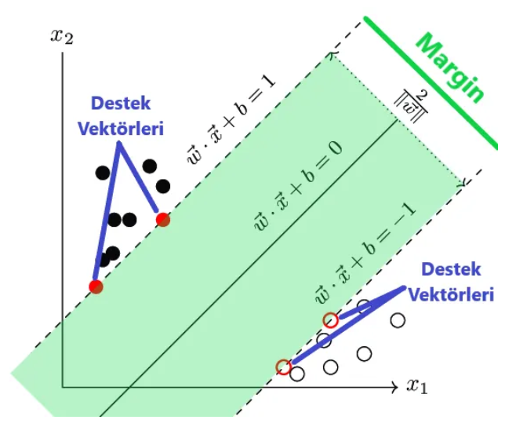
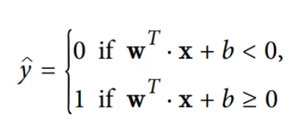
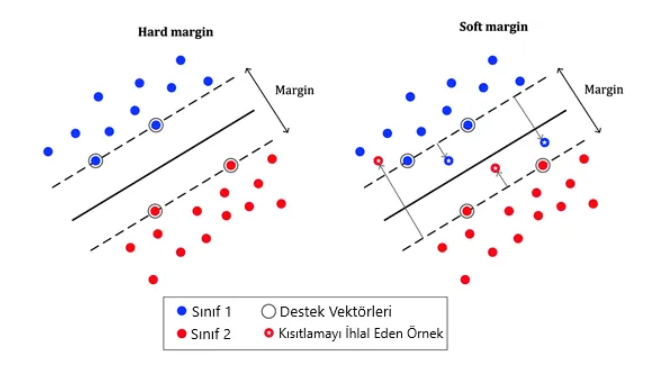
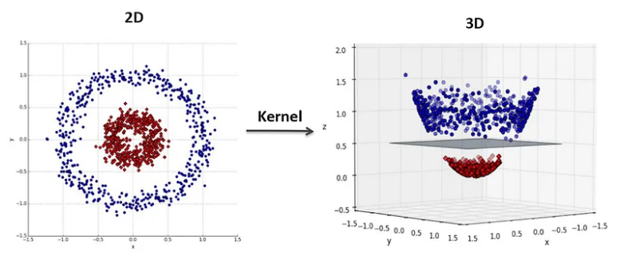
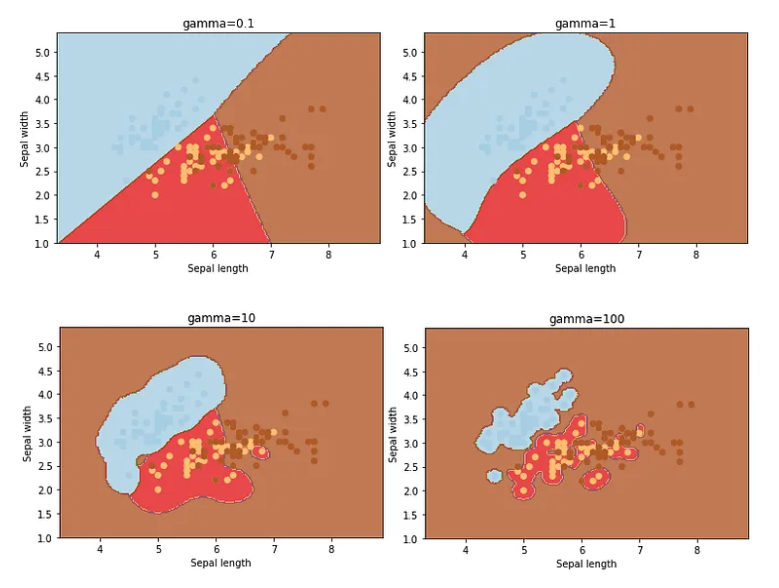

# Support Vector Machine

## Contents
- [Support Vector Machine](#support-vector-machine)
  - [Contents](#contents)
  - [Introduction](#introduction)
  - [Hard Margin vs Soft Margin](#hard-margin-vs-soft-margin)
  - [Kernel Trick](#kernel-trick)
    - [Polynomial Kernel](#polynomial-kernel)
    - [Gaussian RBF (Radial Basis Function) Kernel](#gaussian-rbf-radial-basis-function-kernel)
  - [Multi-Class  SVM](#multi-class--svm)
  - [Non-Linear SVM](#non-linear-svm)
  - [References](#references)

## Introduction

Destek Vektör Makineleri (Support Vector Machine) genellikle sınıflandırma problemlerinde kullanılan gözetimli öğrenme yöntemlerinden biridir. Bir düzlem üzerine yerleştirilmiş noktaları ayırmak için bir doğru çizer. Bu doğrunun, iki sınıfının noktaları için de maksimum uzaklıkta olmasını amaçlar. Karmaşık ama küçük ve orta ölçekteki veri setleri için uygundur.

Tabloda siyahlar ve beyazlar olmak üzere iki farklı sınıf var. Sınıflandırma problemlerindeki asıl amacımız gelecek verinin hangi sınıfta yer alacağını karar vermektir. Bu sınıflandırmayı yapabilmek için iki sınıfı ayıran bir doğru çizilir ve bu doğrunun ±1'i arasında kalan yeşil bölgeye Margin adı verilir. Margin ne kadar geniş ise iki veya daha fazla sınıf o kadar iyi ayrıştırılır.

## Hard Margin vs Soft Margin

Marginimiz her zaman bu şekilde olmayabilir. Bazen örneklerimiz Margin bölgesine girebilir. Buna Soft Margin denir. Hard Margin, verimiz doğrusal olarak ayrılabiliyorsa çalışır ve aykırı değerlere karşı çok duyarlıdır. Bu yüzden bazı durumlarda Soft Margin’i tercih etmemiz gerekebilir.

## Kernel Trick

Düşük boyutlar karmaşık veri setlerini açıklamada yeterli olmayabilir. Boyutu arttırsak işlemler artacağı için çok uzun sürer. İşte Kernel Trick burada devreye giriyor. Elimizdeki koordinatları belirli Kernel Fonksiyonları ile çarparak çok daha anlamlı hale getirebiliyoruz.

### Polynomial Kernel

Bu yöntemde problemimizi çözmek için 2 boyuttan çıkıp 3 veya daha fazlası boyutta işlem yapıyormuş gibi hareket ediyoruz.

Soldaki (2 boyut) dağılımı bir doğru ile sınıflandıramayız. Bunun için bu gibi problemlerde Polynomial Kernel’i kullanabiliriz. 3. boyutta işlem yaparken sınıflara ayırmak için doğru yerine bir düzlem kullanılırız ve çok daha düzgün bir şekilde sınıflandırabiliriz.

Modelimiz overfit olmuşsa derecesini düşürmeniz, underfit olmuşsa derecesini yükseltmeniz gerekir. Ayrıca coef0 hiperparametresiyle modelinizin yüksek dereceli denklemlerden ne kadar etkileneceğini ayarlayabilirsiniz(sadece ‘poly’ ve ‘sigmoid’ kernelda etkili olur).

### Gaussian RBF (Radial Basis Function) Kernel

Sonsuz boyuttaki Destek Vektör Makinelerini bulur ve her bir noktanın belirli bir noktaya ne kadar benzediğini normal dağılım ile hesaplar, ona göre sınıflandırır. Dağılımın genişliğini gamma hiperparametresi ile kontrol ederiz. Gamma ne kadar küçükse dağılım o kadar geniş olur. C hiperparametresindeki gibi, model overfit olmuşsa gamma değerini düşürmemiz, model underfit olmuşsa gamma değerini yükseltmemiz gerekir.

## Multi-Class  SVM

SVM yöntemi ile birden fazla sınıf ayırmak istersek kullanılabilecek 2 farklı yöntem var.
  - One aganist One : Tüm değişkenleri bir biri tek tek ile karşılaştırarak sınıflama işlemi yapıyor.
  - One against All : Bir tane değişken alıp diğer hepsi ile karşılaştırıyor. Genel olarak daha başarılı.

## Non-Linear SVM

Lineer olmayan problemleri çözmeye çalıştığımız zaman kernel yapısından faydalanmamız lazım
Kernel fonksiyonları;
  - Polynomial
  - Gaussian
  - Sigmoid

## References

* https://medium.com/deep-learning-turkiye/nedir-bu-destek-vekt%C3%B6r-makineleri-makine-%C3%B6%C4%9Frenmesi-serisi-2-94e576e4223e