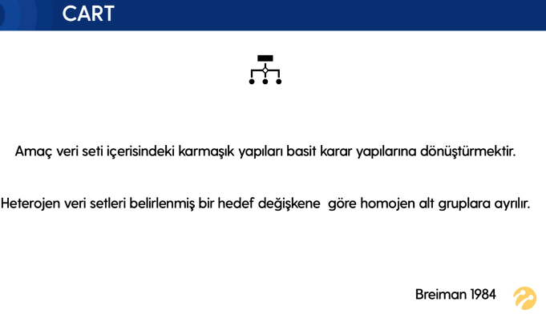
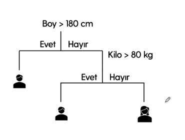
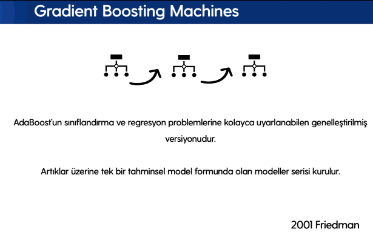
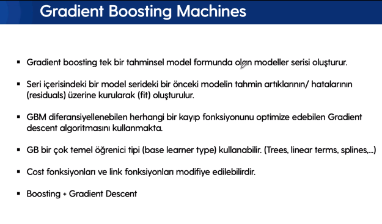
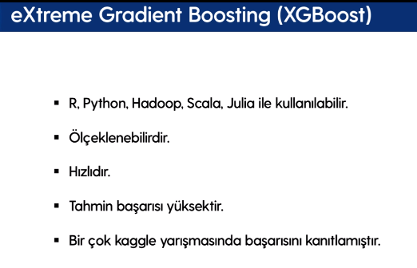
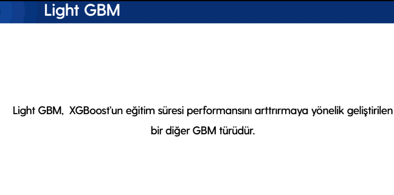
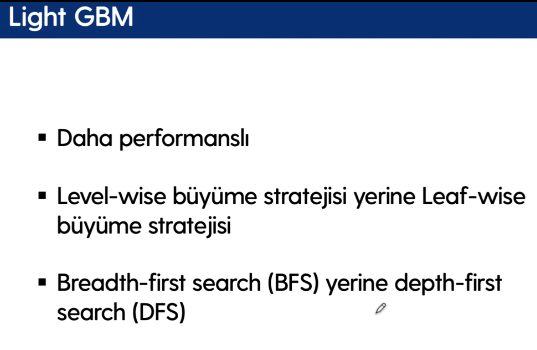
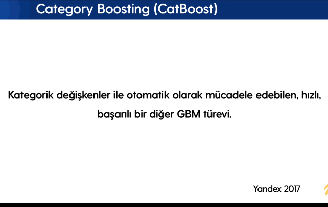
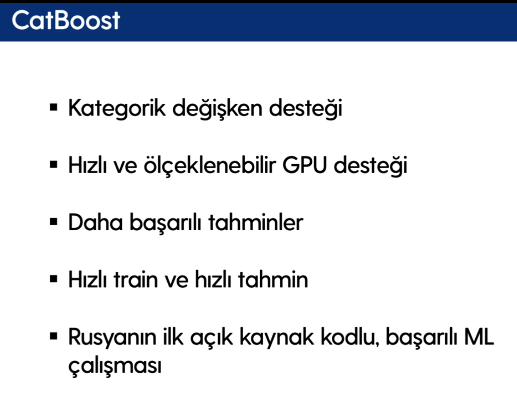

# Tree Based Models

## Contents
- [Tree Based Models](#tree-based-models)
  - [Contents](#contents)
  - [CART](#cart)
  - [Bagging](#bagging)
  - [Boosting](#boosting)
  - [Random Forest](#random-forest)
  - [AdaBoost](#adaboost)
  - [Gradient Boosting Machine](#gradient-boosting-machine)
  - [XGBoost](#xgboost)
  - [LightGBM](#lightgbm)
  - [CatBoost](#catboost)
  - [References](#references)

## CART

Classification and Regression Trees başka bir deyişle CART, 1984 yılında Leo Breiman tarafından ortaya konmuş bir yöntemdir ve Random Forest’ın temelini oluşturur. Karar ağaçlarının gelişmiş yöntemleri, yapay öğrenme kapsamında, tahmin başarısı açısından en yüksek performanslı yöntemlerden biridir.

CART’ın amacı veri seti içerisindeki karmaşık yapıları basit karar yapılarına dönüştürmektir. Heterojen veri setleri belirlenmiş bir hedef değişkene göre homojen alt gruplara ayrılır.

Yukarıda örnek olarak verilen Hitters Veri setinde Beyzbol oyuncularının istatistikleri ve maaşları belirli Kurallara göre CART yapısı ile betimlenmiştir. Deneyim yılı 4.5 yıldan az olan oyuncuların maaş ortalamaları (logaritması alınmış hali) 5.11 olarak belirtilmiştir. Deneyim yılı 4.5 yıla eşit veya fazla olanlar için başka bir değişken olan yapılan atış sayısı üzerinden farklı bir dallanma oluşturularak, 117.5 atıştan az atış yapanların maaş ortalaması 6, eşit veya fazla atış yapanların maaş ortalamaları ise logaritması alınmış şekilde 6.74 olarak ifade edilmiştir.

Karar ağaçlarında Excel tablolarındaki filtrelemelere benzer bir yapı söz konusudur. Bir karar ağacı şemasında en tepede görünen değişken en çok etkide bulunduğundan ötürü en önemli değişkendir. Karar ağaçlarındaki bağımsız değişkenlerle açıklayıcı değişken veya Feature olarak da karşılaşılabilir. Karar ağaçları üzerindeki bağımsız değişkenleri bölen karar noktalarına İç düğüm noktaları (Internal Nodes) denir. Karar ağaçlarının uçlarındaki noktalara Son düğüm noktaları (Terminal Nodes) denir.

CART yapısında en önemli hususlardan biri karar kurallarını çıkarmaktır. Algoritmik bir şekilde belirli referans noktalarına göre hareket ederek ve optimizasyonlar yaparak, iç düğüm ve son düğüm noktaları belirlenmek suretiyle karar kuralları çıkarılır. Bu kapsamda, Ki-Kare (Chi-Square), GINI, Entropy (Information Gain), RSS (SSE), Reduction in Variance gibi bazı metrikleri kullanarak bu karar kuralları belirlenir.

**GINI Katsayısı**, bir karar ağacının bir düğümünde rastgele seçilen bir öğenin yanlış sınıflandırılma olasılığını ölçer. Yani, bir düğümdeki örneğin rastgele seçilen bir sınıfa atandığında yanlış sınıflandırılma olasılığıdır. GINI katsayısı, bir düğümdeki saflığı (purity) veya homojenliği belirlemek için kullanılır. Eğer bir düğüm tamamen saf (yani, tüm örnekler aynı sınıfa aitse), GINI katsayısı 0 olacaktır. Ancak bir düğümdeki örnekler eşit olarak dağılmışsa (yani, her sınıftan eşit sayıda örnek varsa), GINI katsayısı 1'e (maksimum değer) yaklaşır. Öte yandan **Entropy** ise, bir sistemdeki belirsizliği veya rastgeleliği ölçer. Veri biliminde, bir düğümdeki örneklerin saflığını veya karışıklığını belirlemek için kullanılır. Eğer bir düğüm tamamen safsa (yani, tüm örnekler aynı sınıfa aitse), entropy 0 olacaktır. Ancak bir düğümdeki örnekler eşit olarak dağılmışsa (yani, her sınıftan eşit sayıda örnek varsa), entropy 1'e (maksimum değer) yaklaşır.

## Bagging

L. Breiman tarafından önerilmiştir. Var olan bir eğitim setinden yeni eğitim setleri türeterek temel öğreniciyi yeniden eğitmeyi amaçlayan bir yöntemdir. Yerine koyarak örnekleme yapılır. Eğitim kümesi Bagging’de n adet örnekten oluşan eğitim setinden yine n örnekli bir eğitim seti yerine koyarak rastgele seçimle üretilir. Seçilen her örnek tekrar geri eğitim setine geri konulur. Bazı örnekler yeni eğitim kümesinde yer almazken bazıları birden fazla kez yer alırlar.

Rastgele yerine koyarak seçilen eğitim kümeleri ile başarılı temel öğreneciler eğitilerek ayrıklık sağlanır. Böylece kolektif bir başarı elde edilir. Topluluktaki her bir temel(base) öğrenici bu şekilde üretilmiş birbirinden farklı örnekler içeren eğitim kümeleriyle eğitilirler ve sonuçları çoğunluk oylaması ile kararlar birleştirilir.

Temel öğrenicilerin karar ağaçları olması zorunlu değildir. Herhangi bir makina öğrenme algoritması temel öğrenici olabilir. Ama Bagging için minimum eğitim kümesinin değişikliğinde bile sonucu max etkileyecek temel öğrenicilerin seçilmesi başarıyı artıracaktır. Örneğin KNN yerine karar ağaçları daha mantıklı olacaktır.

Regresyon verilerde temel öğrenicilerin kararları ortalama, sınıflandırma verilerinde ise demokrasi(voting) usulu ile belirlenir. Yani en çok hangi sınıf etiketi ise o örnek oy birliği ile tahminlenir.

**İşlem Adımları**

* Orijinal veri kümesinden çoklu alt kümeler oluşturulur.
* Bu alt grupların her birinde bir temel model (zayıf model) oluşturulmuştur.
* Modeller paralel olarak çalışır ve birbirinden bağımsızdır.
* Nihai tahminler, tüm modellerden gelen tahminler birleştirilerek belirlenir.

## Boosting

Yükseltme (Boosting) yöntemindeki temel fikir, veri setine farklı ağırlıklar verilmesi sonucu elde edilen ağaçlar topluluğundan çıkarsamalar yapılmasıdır. Başlangıçta tüm gözlemler eşit ağırlığa sahiptir. Ağaç topluluğu büyümeye başladıkça, problem bilgisine kurulu olarak ağırlıklandırmalar düzenlenir. Yanlış sınıflandırılan gözlemlerin ağırlığı arttırılırken, nadiren yanlış sınıflandırılan gözlemlerin ağırlığı azaltılır. Bu sayede ağaçlar zor durumlar karşısında kendini düzenleyebilme yeteneği kazanır.

**İşlem Adımları**

* Orijinal veri kümesinden bir alt küme oluşturulur.
* Başlangıçta, tüm veri noktalarına eşit ağırlık verilir.
* Bu alt kümede bir temel model oluşturulur.
* Bu model, tüm veri kümesi için tahminler yapmak için kullanılır.
  

* Hatalar gerçek değerler ve öngörülen değerler kullanılarak hesaplanır.
* Yanlış öngörülen gözlemlere daha fazla ağırlık verilir. (Burada, sınıflandırılmamış olan üç tane mavi artı noktaya daha fazla ağırlık verilecektir.)

* Başka bir model oluşturulur ve veri setinde tahminler yapılır. (Bu model önceki modeldeki hataları düzeltmeye çalışır.)
* Benzer şekilde, her biri önceki modelin hatalarını düzelten çoklu modeller oluşturulur.
* Son model (güçlü öğrenen), tüm modellerin ağırlıklı ortalamasıdır.

---

**Bagging Algoritmaları**

* Bagging meta-estimator
* Random Forest

**Boosting Algoritmaları**

* AdaBoost
* GBM
* XGBM

> **Bagging -Torbalama:** Bir grup modeli paralel bir şekilde eğitiyoruz. Her model, verilerin rastgele bir alt kümesiyle eğitilir.

> **Boosting -Güçlendirme:** Bir grup bağımsız modeli sıralı bir şekilde eğitiyoruz. Her bir model, önceki modelin yaptığı hatalardan öğrenir.

---

**Ensemble Learning Methods**

*Maximum Oylama(Max Voting):* Genellikle sınıflandırma problemlerinde kullanılır.

*Ortalama(Averaging):* Regresyon problemlerinde tahmin yapmak için veya sınıflandırma problemleri için olasılıkları hesaplarken kullanılabilir.

*Ağırlıklı Ortalama(Weighted Averaging):* Ortalama yönteminin uzantısıdır. Tüm modellerde, tahmin için her modelin önemini tanımlayan farklı ağırlıklar vardır. Örneğin, meslektaşlarınızın tasarımınız hakkındaki cevaplarına diğerlerinin cevaplarından daha fazla önem verilir.

*Yığma(Stacking) :* Yeni bir model oluşturmak için birden fazla modelden (örneğin karar ağacı(decision tree), KNN veya SVM) tahminleri kullanan bir topluluk öğrenimi tekniğidir. Bu model, test setinde öngörülerde bulunmak için kullanılır.

*Harmanlama(Blending) :* Yığma ile aynı yaklaşımı izler, ancak yalnızca tahmin yapmak için eğitim seti tarafından ayarlanan bir doğrulama kullanır.

## Random Forest

Rassal orman (Random Forest), hiper parametre kestirimi yapılmadan da iyi sonuçlar vermesi hem regresyon hem de sınıflandırma problemlerine uygulanabilir olmasından dolayı popüler makine öğrenmesi modellerinden biri. Rassal ormanı anlamak için önce bu modelin temel blogu olan karar ağaçlarını anlamak gerekiyor. 3. dersi bu konuya ayırmıştık başarılı bir karar ağacı günlük hayatta bilgi kazancını arttıracak sorular soran ve isabetli tahminler yapan insanlara benzetilebilir.

Fakat geleneksel yöntemlerden biri olan karar ağaçlarının en büyük problemlerinden biri aşırı öğrenme-veriyi ezberlemedir (overfitting). Rassal orman modeli bu problemi çözmek için hem veri setinden hem de öznitelik setinden rassal olarak 10'larca 100'lerce farklı alt-setler seçiyor ve bunları eğitiyor. Bu yöntemle 100'lerce karar ağacı oluşturuluyor ve her bir karar ağacı bireysel olarak tahminde bulunuyor. Günün sonunda problemimiz regresyonsa karar ağaçlarının tahminlerinin ortalamasını problemimiz sınıflandırmaysa tahminler arasında en çok oy alanı seçiyoruz.

Random forest modelinin diğer bir özelliği bize özniteliklerin ne kadar önemli olduğunu vermesi. (Bir özniteliğin önemli olması demek o özniteliğin bağımlı değişkendeki varyansın açıklanmasına ne kadar katkı yaptığıyla alakalı.) Random forest algoritmasına x sayıda öznitelik verip en faydalı y tanesini seçmesini isteyebiliriz ve istersek bu bilgiyi istediğimiz başka bir modelde kullanabiliriz.

## AdaBoost

AdaBoost, ilk boosting algoritması olarak sayılır ve bilgisayar dünyasında önemli ödüllerden biri olan Gödel ödülünü kazanmıştır. Bu modelde eğitim kümesi önce bir zayıf öğrenici ile eğitilir. Eğitim sonrası yanlış olarak tahminlenen örnekler bu algoritma için önemlidir. Bir sonraki eğitimde ilk tahminlemede yanlış öğrenilen eğitim verilerine daha fazla öncelik verilerek yani ağırlıkları artırarak tekrar eğitilir.

Adaptif Boosting veya AdaBoost, en basit yükseltme algoritmalarından biridir. Genellikle, karar ağaçları modelleme için kullanılır. Her biri son modeldeki hataları düzelten çoklu sıralı modeller oluşturulur. AdaBoost, yanlış tahmin edilen gözlemlere ağırlık atar ve sonraki model bu değerleri doğru şekilde tahmin etmek için çalışır.

Eğitim kümesinden eğitilmiş maksimum derinliğe sahip karar ağaçları kullanılmaz. Bunun yerine zayıf öğrenici olarak AdaBoost ile bir nod ve iki yapraktan oluşan derinliği bir olan karar ağaçları kullanılır. Kümülatif bir yapı olduğu için sıralama önemlidir. İlk karar ağacının yaptığı hata, ikinci ağacın ağırlıklarını etkiler. Bagging yönteminin aksine parelel bir hesaplama yapmaz bunun yerine ardışık bir hesaplama yapılır.

**AdaBoost Algoritmasını Gerçekleştirme Adımları**

* Başlangıçta, veri kümesindeki tüm gözlemlere eşit ağırlık verilir.
* Bir model, veri alt kümesine dayanır.
* Bu model kullanılarak, tüm veri seti için tahminler yapılmıştır.
* Hatalar tahminler ve gerçek değerler karşılaştırılarak hesaplanır.
* Bir sonraki modeli oluştururken, yanlış tahmin edilen veri noktalarına daha fazla ağırlık verilir.
* Ağırlıklar hata değeri kullanılarak belirlenebilir. Örneğin, hata ne kadar yüksekse, gözlem için tayin edilen ağırlıktır.
* Bu işlem, hata fonksiyonu değişmeden veya tahmin edicilerin sayısının maksimum limitine ulaşılana kadar tekrarlanır.

## Gradient Boosting Machine

Gradyan artırıcı karar ağaçlarında, güçlü bir öğrenci bulmak için birçok zayıf öğrenciyi birleştiriyoruz. Buradaki zayıf öğrenciler, bireysel karar ağaçlarıdır.
Tüm ağaçlar seri olarak bağlanır ve her ağaç bir önceki ağacın hatasını en aza indirmeye çalışır.

Bu sıralı bağlantı nedeniyle, yükseltme algoritmalarının öğrenilmesi genellikle yavaştır (öğrenme hızı parametresi kullanılarak geliştirici tarafından kontrol edilebilir), ancak aynı zamanda oldukça doğrudur. İstatistiksel öğrenmede, yavaş öğrenen modeller daha iyi performans gösterir.

Gradient Boosting veya GBM, hem regresyon hem de sınıflandırma problemleri için çalışan bir başka topluluk makine öğrenme algoritmasıdır. GBM, güçlü bir öğrenici oluşturmak için birtakım zayıf öğrenicileri birleştirerek, yükseltme tekniğini kullanır. Temel öğrenici olarak kullanılan regresyon ağaçları, her biri seri halinde olan bir ağaç önceki ağaç tarafından hesaplanan hatalar üzerine kuruludur.

## XGBoost

XGBoost (extreme Gradient Boost), gradient boosting algoritmasının gelişmiş bir uygulamasıdır. XGBoost, yaygın olarak makine öğrenimi yarışmalarında kullanılan son derece etkili bir makine öğrenmesi algoritması olduğunu kanıtladı. XGBoost yüksek tahmin gücüne sahiptir ve diğer gradient boosting tekniklerinden neredeyse 10 kat daha hızlıdır. Ayrıca, fazla uyumu azaltan ve genel performansı artıran çeşitli düzenlemeler içerir. Bu nedenle “düzenli artırma” tekniği olarak da bilinir.

XGBoost’un diğer tekniklerden nispeten nasıl daha iyi olduğunu görelim:

*Düzenlileştirme (Regularization):*
Standart GBM uygulamasının XGBoost gibi bir düzenlemesi yoktur.
Bu nedenle, XGBoost ayrıca aşırı takılmayı azaltmaya da yardımcı olur.

*Paralel İşleme (Parallel Processing):*
XGBoost paralel işleme uygular ve GBM’den daha hızlıdır.

*Yüksek Esneklik (High Flexibility):*
XGBoost, kullanıcıların modele yepyeni bir boyut katan özel optimizasyon hedefleri ve değerlendirme kriterleri tanımlamasını sağlar.

*Eksik Değerlerin Kullanılması (Handling Missing Values):*
XGBoost, eksik değerleri işlemek için yerleşik bir rutine sahiptir.

*Ağaç Budaması (Tree Pruning):*
XGBoost, belirtilen max_depth değerine kadar bölmeleri oluşturur ve ardından ağacı geriye doğru budamaya başlar ve ötesinde pozitif kazanç olmayan bölmeleri kaldırır.

*max_depth* = Maksimum derinliği tanımlamak için kullanılır.
Daha yüksek derinlik, modelin belirli bir örneğe özel olan ilişkileri öğrenmesini sağlayacaktır.

*Dahili Çapraz Doğrulama (Built-in Cross-Validation):*
XGBoost, bir kullanıcının, yükseltme işleminin her bir yinelemesinde bir çapraz doğrulama yapmasına izin verir ve böylece tek bir işlemde tam olarak optimum sayıda yükseltme iterasyonu elde etmek kolaydır.

> XGBoost, eksik değerlerin kendisiyle ilgilendiği için, eksik değerleri doldurmanız gerekmez.

## LightGBM

LightGBM, Microsoft DMTK (Distributed Machine Learning Toolkit) projesi kapsamında 2017 yılında geliştirilmiş bir boosting algoritmasıdır. Diğer boosting algoritmaları ile karşılaştırıldığında yüksek işlem hızı, büyük verileri işleyebilmesi, daha az kaynak(RAM) kullanımı, yüksek tahmin oranı, paralel öğrenme ve GPU öğrenimini desteklemesi gibi avantajları vardır. Modelin tanıtıldığı “LightGBM: A Highly Efficient Gradient Boosting Decision Tree” makalesine göre, yapılan çalışmalarda LightGBM’in diğer modellere göre 20 kat daha hızlı olduğu sonucuna ulaşılmıştır.

## CatBoost

Catboost, Yandex şirketi tarafından geliştirilmiş olan Gradient Boosting tabanlı açık kaynak kodlu bir makine öğrenmesi algoritmasıdır. Gradient Boosting’in performansını arttırmak amacıyla geliştirilen XGBoost ve LightGBM’e alternatif olarak Nisan 2017 tarihinde “CatBoost: unbiased boosting with categorical features” makalesiyle tanıtılmıştır. Adı “Category” ve “Boosting” kelimelerinin birleşiminden gelmektedir. Kategori arttıkça dal ve ağaç yapısı çok büyüyecektir. Bunun önüne geçmeyi hedefleyen bir yapıdır. Kategorik verilerin çok olduğu veri setleri için tercih edilebilir.

CatBoost, veri hazırlığı evresini kısaltması ile önemli bir konuma sahiptir. Boş veriler ile başa çıkabilir, kategorik verilere kodlama(encoding) uygular.

Kategorik veriler ile yüksek performanslı çalışabilmesinin nedeni kendine has bir kodlama metoduna sahip olmasıdır. Yani veri hazırlığı yaparken ayrıca bir kodlama işlemi yapılmasına gerek duyulmamaktadır. Hatta kodlama yapılmaması özellikle tavsiye edilir. Bu hem öğrenme hızını hem de sonuçların kalitesini etkileyecektir.

Ayrıca Catboost simetrik ağaçlar kurar. Bu sayede çok derin ağaçlar kurmadan yüksek tahmin oranı yakalar ve aşırı öğrenme sorununu aşar.

## References

* https://serdartafrali.medium.com/makine-ogrenmesi-cart-c318a49e0fdd#:~:text=Classification%20and%20Regression%20Trees%20ba%C5%9Fka,en%20y%C3%BCksek%20performansl%C4%B1%20y%C3%B6ntemlerden%20biridir.
* https://medium.com/data-science-tr/makine-%C3%B6%C4%9Frenmesi-dersleri-5-bagging-ve-random-forest-2f803cf21e07
* https://medium.com/deep-learning-turkiye/ensemble-learning-bagging-ve-boosting-50643428b22b
* https://kadirguzel.medium.com/kolektif-%C3%B6%C4%9Frenme-ve-bagging-algoritmas%C4%B1-e8ea3d932b72
* https://kadirguzel.medium.com/boosting-nedir-ad%C4%B1m-ad%C4%B1m-adaboost-algoritmas%C4%B1-439cce20ab9a
* https://www.veribilimiokulu.com/lightgbm/
* https://www.veribilimiokulu.com/catboost-nedir-diger-boosting-algoritmalarindan-farki-nelerdir/
