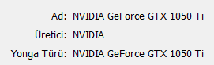
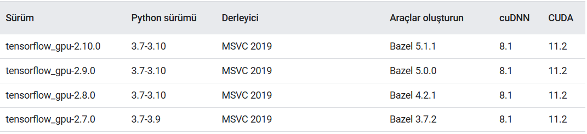
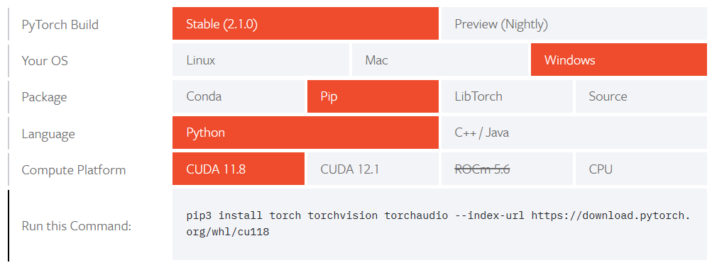

# Use Local GPU

## Contents
- [Use Local GPU](#use-local-gpu)
  - [Contents](#contents)
  - [Introduction](#introduction)
  - [Check System GPU](#check-system-gpu)
  - [Installation](#installation)
    - [Tensorflow](#tensorflow)
    - [Pytorch](#pytorch)
  - [References](#references)

## Introduction

Her geçen gün Yapay Zeka alanında gerçekleştirilen yeniliklere şahitlik etmekteyiz. Geliştirilen modeller açık kaynaklı (open-source) olarak biz geliştiriciler ve kullanıcalarla da paylaşılmakta ve bu modelleri kullanma imkanı sağlanmaktadır. Bu noktada yerel bilgisayar üzerinde yapılacak olan çalışmalarda modellerin eğitiminde GPU işlem biriminin kullanılması büyük önem arz etmektedir. Çünkü CPU birimi üzerinden kendi kullanımıza uygun olarak bu modelleri çok mümkün değildir. Bu çalışmada yerel bilgisayarımız üzerinde GPU birimi mevcut mu ? Yerel GPU birimimi model eğitiminde kullanmak için hangi işlem adımlarını yapmalıyım bunları göreceğiz.

## Check System GPU

İlk olarak GPU biriminin olup olmadığını kontrol etmek için aşağıdaki komutu çalıştırmamız gerekiyor. Açılan pencerede sistemde var olan CPU birimini ve GPU birimlerini görmek mümkündür.

```
dxdiag
```



Sistemteki var olan GPU biriminin CUDA'yı desteklemesi gerekmektedir. Bunun için NVIDIA'nin sitesinden kontrollerin yapılması gerekir. Kontrol için [bağlantıya](https://developer.nvidia.com/cuda-gpus) gidebilirsiniz.

Tüm bu kontrollerden başarılı bir şekilde geçtikten sonra artık gerekli kurulumları yapmaya başlayabiliriz.

## Installation

Gerekli kontrolleri geçtik. Artık var olan GPU biriminin kullanılabilmesi için bazı kurulumların yapılması gerekmektedir. Bu noktada kurulumları iki alt başlık altında inceleyeceğiz.

### Tensorflow

Tensorflow ile GPU kullanımı için ilk önce versiyon kontrolü yapmamız gerekiyor. Versiyon kontrol için [bağlantıya](https://www.tensorflow.org/install/source_windows?hl=tr) gidebilirsiniz. Bu bağlantı üzerinden ilgili *tensorflow* ve *tensorflow_gpu* kütüphane versiyonları kurulmalıdır. Bu kütüphane versiyonlarına uygun olarak diğer kurulumlar yapılmalıdır.



**Örnek işlem adımları**

1. Uygun tensorflow ve Python sürümlerinin kurulması
2. Uygun cuDNN versiyonunun kurulması
3. Uygun CUDA versiyonunun kurulması

```py
# See all library
# Check tensorflow and tensorflow_gpu version
!pip list
```

```py
gpus = tf.config.experimental.list_physical_devices('GPU')
print(gpus)
for gpu in gpus:
    tf.config.experimental.set_memory_growth(gpu, True)
```

```py
# Run this code and see the difference

from numba import jit, cuda 
import numpy as np 
# to measure exec time 
from timeit import default_timer as timer    
  
# normal function to run on cpu 
def func(a):                                 
    for i in range(10000000): 
        a[i]+= 1      
  
# function optimized to run on gpu  
@jit(target_backend='cuda')                          
def func2(a): 
    for i in range(10000000): 
        a[i]+= 1
if __name__=="__main__": 
    n = 10000000                            
    a = np.ones(n, dtype = np.float64) 
      
    start = timer() 
    func(a) 
    print("without GPU:", timer()-start)     
      
    start = timer() 
    func2(a) 
    print("with GPU:", timer()-start)
```

### Pytorch

Pytorch ile GPU kurulumu için yine versiyon kontrollerini yapmak gerekiyor. Versiyon kontrolleri ve ilgili kod için [bağlantıya](https://pytorch.org/get-started/locally/) tıklayabilirsiniz. Oluşuna kodu yerel bilgisayar üzerinde komut işlemcisinde çalıştırıldığı zaman gerekli kurulumlar yapılmış olacaktır.



```py
# Check available

import torch

if torch.cuda.is_available():    
  
    # To check whether GPU is available or not
    device = torch.device("cuda")
    print("GPU is available")
    print("Device:", device)
```


## References

* https://www.tensorflow.org/install/source_windows?hl=tr
* https://developer.nvidia.com/cuda-gpus
* https://www.youtube.com/watch?v=DASXW0UuZNY
* https://www.youtube.com/watch?v=1Cs5NvLr6iM